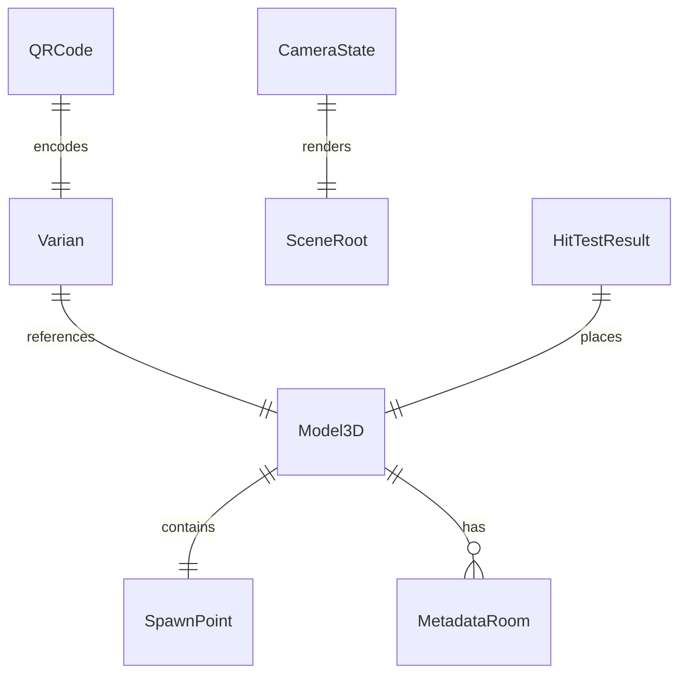
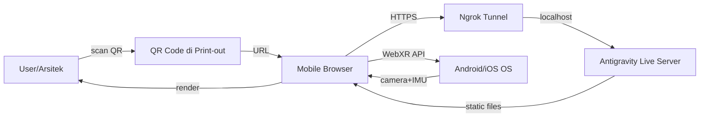
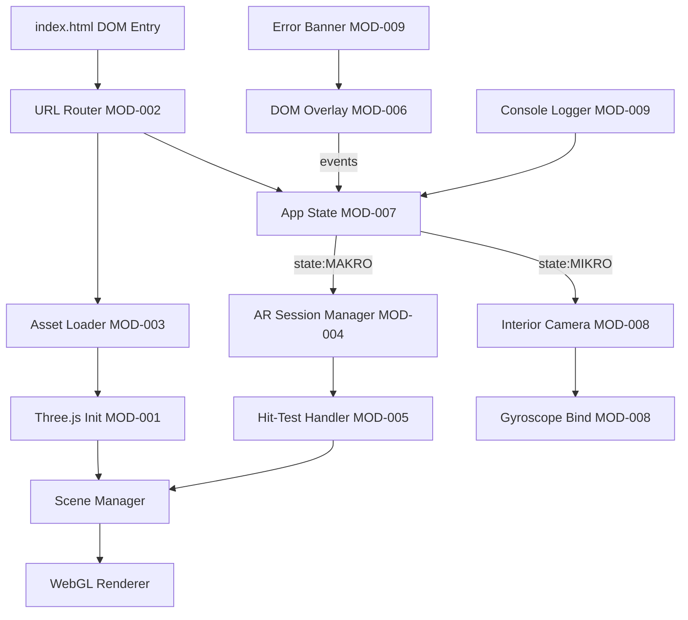
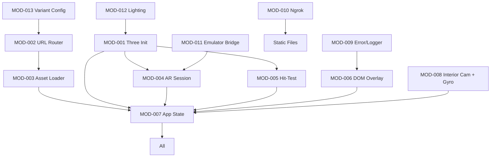
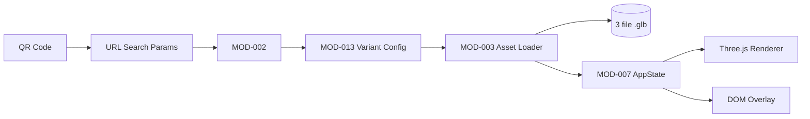

# UrbanScale WebAR - Master Technical Blueprint
### Clean Production Template v2.1
### Universal AI-Ready Blueprint for WebAR, WebXR, and 3D Web Applications

---

## Metadata

| Field | Value |
|---|---|
| Blueprint Version | 1.0.0 |
| Blueprint Status | Active |
| Project Name | UrbanScale WebAR: Prototipe Visualisasi Spasial dan Analisis Tata Ruang Arsitektur dengan Transisi Makro-Mikro Berbasis WebXR |
| Project Stage | Prototype |
| Last Updated | 2026-07-14 |
| Owner/Maintainer | Achmed Bintang Asy-Syfa M. (23.11.5818) |
| Technical Owner | Achmed Bintang Asy-Syfa M. (WebXR & Three.js Dev) |
| Product Owner | Awaludin (23.11.5822) |
| Project Type(s) | Web App (Single-Page WebAR), Computer Graphics, WebXR |
| Repository | Local-only project on Antigravity IDE (no public repo at this stage) |
| Deployment Target | Mobile Browser (Chrome/Safari Android/iOS) via HTTPS Ngrok tunnel |
| Document Size Check | Approx. 1400 lines |
| Companion Files | AGENTS.md, README.md, index.html, /assets/*.glb, /js/*.js, /css/*.css |

---

# ID Convention Legend

Reasoning:
Stable IDs make the Blueprint searchable, auditable, and traceable. They help humans and AI answer questions like:
- Which requirement has no test?
- Which component owns this data?
- Which state owns the camera?
- Which ADR explains this architecture?

| Prefix | Used For | Example |
|---|---|---|
| GOAL- | Project goal | GOAL-001 |
| NOGOAL- | Explicit non-goal | NOGOAL-001 |
| USER- | User type or persona | USER-001 |
| METRIC- | Product/business metric | METRIC-001 |
| REQ- | Functional requirement | REQ-001 |
| NFR- | Non-functional requirement | NFR-001 |
| UC- | Use case | UC-001 |
| BR- | Business/domain rule | BR-001 |
| INV- | Domain invariant | INV-001 |
| ENT- | Domain entity | ENT-001 |
| MOD- | Component/module/service | MOD-001 |
| API- | API contract | API-001 |
| EVT- | Event contract | EVT-001 |
| SCHEMA- | Data/schema contract | SCHEMA-001 |
| DATA- | Data store or data entity | DATA-001 |
| DS- | Dataset | DS-001 |
| TEST- | Test case or test suite | TEST-001 |
| TASK- | Implementation task | TASK-001 |
| ADR- | Architecture Decision Record | ADR-001 |
| RISK- | Risk item | RISK-001 |
| THREAT- | Security threat | THREAT-001 |
| ALERT- | Operational alert | ALERT-001 |
| DRIFT- | Blueprint/code drift | DRIFT-001 |
| ASM- | Assumption | ASM-001 |
| Q- | Clarification question | Q-001 |
| DEC- | Open decision | DEC-001 |
| CON-TECH- | Technical constraint | CON-TECH-001 |
| CON-BIZ- | Business constraint | CON-BIZ-001 |
| CON-LAW- | Legal/privacy/compliance constraint | CON-LAW-001 |
| STATE- | Application state machine state | STATE-001 |
| ASET- | 3D asset identifier | ASET-001 |

Rule:
Do not create new ID prefixes unless the ID Convention Legend is updated first.

---

# 0. How To Read This Blueprint

## 0.1 Purpose

This Blueprint is the source of truth for:
- Project purpose and goals
- Domain language (AR/VR/WebXR terms)
- Requirements (functional and non-functional)
- Architecture (Camera State Machine, URL Routing, GLTF pipeline)
- Component boundaries (DOM Overlay vs 3D Scene vs State Controller)
- Dependency rules (Three.js, WebXR, DeviceOrientation)
- Asset and state contracts
- Security/privacy rules (camera permission, HTTPS)
- Coding standards (vanilla JS, ES6+)
- Testing strategy (WebXR Emulator + Ngrok)
- Observability (console logging, error banners)
- Roadmap (4 sprint phases)
- ADRs (why WebXR over 8th Wall, why zero-budget stack)
- AI IDE collaboration rules

## 0.2 For Human Onboarding

Recommended reading order:

1. Section 1 - Executive Summary
2. Section 2 - Context and Constraints
3. Section 3 - Domain Model and Glossary
4. Section 5 - Architecture Overview
5. Section 6 - Component Specifications
6. Section 7 - Dependency Map
7. Section 12 - Conventions and Standards
8. Section 17 - AI Collaboration Protocol
9. Relevant ADRs and component specs

## 0.3 For AI IDE Assistant

Before writing or changing code:

1. Read Section 1 and Section 5 for global context.
2. Read Section 4 for related requirements.
3. Read Section 6.2 for affected components.
4. Read Section 7 for dependency rules.
5. Read Section 9 for public contracts if APIs/events/interfaces are affected.
6. Read Section 12 for conventions.
7. Read Section 17 for AI collaboration rules.
8. Read related ADRs in Section 18.
9. Make a short implementation plan.
10. Implement with minimal scope.
11. Add or update tests.
12. Report assumptions, risks, and Blueprint drift.

## 0.4 Status Legend

| Status | Meaning |
|---|---|
| Proposed | Planned but not approved |
| Planned | Approved for future work |
| In Progress | Currently being implemented |
| Stable | Implemented and accepted |
| Frozen | Do not change without approval |
| Deprecated | Do not use for new work |
| Replaced | Superseded by another item |

## 0.5 Decision Tags

Use these exact tags when filling or maintaining the Blueprint.

| Tag | Meaning |
|---|---|
| ASSUMPTION | A reasonable guess was made because information is incomplete |
| CLARIFICATION_NEEDED | A specific question must be answered |
| CONFLICT_NEEDS_REVIEW | Two or more pieces of information conflict |
| BLUEPRINT_DRIFT | Code and Blueprint are no longer aligned |
| SECURITY_REVIEW_REQUIRED | Security/privacy impact requires explicit review |
| DECISION_REQUIRED | A technical/product decision is needed before continuing |
| N/A | Section does not apply, with reason |

## 0.6 Conditional Sections

Some sections are conditional. If no trigger applies, write:

```text
N/A - [clear reason]
```

If any trigger applies, fill the section fully.

Conditional sections include:
- Section 9 - API, Interface, and Event Contracts (activated - URL Routing contract + Camera State contract exist)
- Section 13 - Security, Privacy, and Compliance (activated - camera permission, HTTPS required)
- Section 16 - Observability and Operations (activated - local console logging only)
- Section 22 - Domain-Specific Extensions (activated - 22.3 Web App, 22.4 Mobile-like, 22.8 Game-like 3D)

## 0.7 Graduation Rule: Single-Document to Multi-File

This Blueprint is a single portable document.

Keep it as a single document because:
- Team size is 3 people
- Project is in prototype stage
- Document is below 2500 lines
- One technical owner (Achmed) drives the main WebXR logic
- Only one editor updates the Blueprint at a time

Graduation is NOT required at this stage.

If the project grows to a real client product, graduate per Appendix C.

## 0.8 Canonical Source Map

| Topic | Canonical Section |
|---|---|
| Project goals | Section 1 |
| Domain terms | Section 3 |
| Functional requirements | Section 4 |
| Architecture overview | Section 5 |
| Component ownership | Section 6 |
| Dependency and architecture rules | Section 7 |
| Asset and state contracts | Section 9 |
| Technology choices | Section 10 and ADRs |
| Non-functional targets | Section 11 |
| Coding conventions | Section 12 |
| Security/privacy | Section 13 |
| Development workflow | Section 14 |
| Testing and quality gates | Section 15 |
| Observability | Section 16 |
| AI behavior rules | Section 17 |
| Architecture decisions | Section 18 |
| Risks | Section 19 |
| Roadmap | Section 20 |
| Change management | Section 21 |

---

# 1. Executive Summary

## 1.1 Elevator Pitch

UrbanScale WebAR is a mobile browser application that lets architecture evaluators project a 3D building model onto a real floor, walk around it physically, then teleport inside to inspect the interior by tilting the phone. It runs as a single static web page with Three.js and WebXR, accessed via QR code, requiring no native app and no server.

## 1.2 Problem Statement

Architecture design review today is split between two awkward tools: AR apps that show building mass from outside but cannot go inside, and VR apps that show interiors but require expensive HMDs and heavy native software. UrbanScale WebAR fuses both into one frictionless browser pipeline, with zero install cost and zero server cost.

## 1.3 Proposed Solution

A Camera State Machine that toggles between two modes:
- MAKRO (Markerless WebAR): WebXR Hit-Test places a glTF model on the floor. VIO keeps the model anchored as the user walks around it.
- MIKRO (First-Person Interior): WebXR tracking stops, the Three.js camera is teleported to a defined coordinate inside the model, and rotation is bound to the phone's Gyroscope (DeviceOrientation API).

The transition is a single tap on a DOM overlay button. A URL Routing layer (URLSearchParams) reads the QR-scanned parameter and loads only the one glTF model that matches, preventing browser memory crashes.

## 1.4 Target Users

| User ID | User Type | Description | Main Needs |
|---|---|---|---|
| USER-001 | Mahasiswa Arsitektur/Desain | Evaluator prototipe desain yang butuh tinjauan spasial cepat. | Walkaround AR + interior look-around tanpa install app. |
| USER-002 | Dosen Arsitektur/Desain | Penilai tugas akhir atau studio yang ingin demo prototipe kepada kelas. | Akses instan via QR Code ke beberapa varian desain. |
| USER-003 | Evaluator Desain Profesional | Reviewer yang membandingkan opsi desain tanpa membuka software 3D desktop. | Toggling cepat antar varian via QR Code yang berbeda. |
| USER-004 | Pengembang Informatika | Pembelajar yang mempelajari WebXR, Three.js, dan sensor fusion. | Studi kasus implementasi yang bersih dan terdokumentasi. |

## 1.5 Primary Use Cases

| Use Case ID | Use Case | Actor | Expected Outcome |
|---|---|---|---|
| UC-001 | Scan QR & Load Model | USER-001/002/003 | Browser membuka URL, parameter QR dibaca, satu model glTF di-load. |
| UC-002 | Place Model on Floor | USER-001/002/003 | Tap layar setelah melihat reticle, model muncul di lantai. |
| UC-003 | Physical Walkaround | USER-001/002/003 | Berjalan mengelilingi model, model tidak bergeser (zero-drift). |
| UC-004 | Enter Interior | USER-001/002/003 | Tap "Masuk ke Ruangan", transisi ke Mode Mikro dalam < 1 detik. |
| UC-005 | Look-Around Interior | USER-001/002/003 | Menolehkan HP, viewport interior mengikuti arah gyroscope. |
| UC-006 | Exit Interior | USER-001/002/003 | Tap "Keluar ke Maket", kembali ke Mode Makro. |
| UC-007 | Switch Varian Desain | USER-001/002/003 | Scan QR Code varian lain, model baru di-load tanpa reload halaman. |
| UC-008 | Local Dev Testing | USER-004 / Dev Team | Jalankan di laptop, gunakan WebXR Emulator untuk simulasi. |

## 1.6 Goals

| Goal ID | Goal | Success Metric | Priority | Reasoning |
|---|---|---|---|---|
| GOAL-001 | Membangun aplikasi WebAR dengan transisi Makro-Mikro. | Berhasil berpindah mode tanpa reload aset. | High | Inti dari proyek. |
| GOAL-002 | Menjaga zero-drift saat walkaround. | Model tidak bergeser > 5 cm saat user mengelilingi radius 1.5 m. | High | Validasi VIO tracking. |
| GOAL-003 | Switch interior dalam < 1 detik. | Waktu dari tap tombol ke viewport interior aktif < 1 s. | High | UX requirement. |
| GOAL-004 | Optimalisasi memori via URL Routing. | Hanya 1 model di-load per sesi browser, total RAM < 250 MB. | High | Mencegah crash mobile. |
| GOAL-005 | Zero-budget development. | Tidak ada biaya server, tidak ada lisensi SDK berbayar. | High | Sesuai constraint tugas. |
| GOAL-006 | Frictionless access. | Dari scan QR ke AR aktif < 5 detik (pada HP mid-range). | Medium | Onboarding yang baik. |
| GOAL-007 | Multi-varian desain. | 3 QR Code untuk 3 model glTF yang berbeda, masing-masing berfungsi. | Medium | Sesuai proposal 5.1. |

## 1.7 Non-Goals

| Non-Goal ID | Non-Goal | Reason |
|---|---|---|
| NOGOAL-001 | Membuat aplikasi native (APK/IPA). | Constraint tugas: WebAR only. |
| NOGOAL-002 | Menambahkan Spatial Audio (HRTF). | Ditandai sebagai rencana lanjutan di proposal 6.2, bukan scope semester ini. |
| NOGOAL-003 | Implementasi Interactive Hotspots (raycasting). | Rencana lanjutan proposal 6.2. |
| NOGOAL-004 | Multiplayer tour via WebRTC. | Rencana lanjutan proposal 6.2, di luar scope. |
| NOGOAL-005 | Backend server dan database cloud. | Zero-budget, single-page app. |
| NOGOAL-006 | Akun pengguna / login / profil. | Tidak ada personalisasi data, hanya publik. |
| NOGOAL-007 | Marker-based AR (marker fisik sebagai penanda). | Proposal secara eksplisit memilih Markerless. |
| NOGOAL-008 | Dukungan untuk desktop WebXR (HMD PC). | Target adalah mobile browser, bukan headset PCVR. |

## 1.8 Success Metrics

| Metric ID | Metric | Target | Measurement Method |
|---|---|---|---|
| METRIC-001 | Transisi Makro ke Mikro | < 1 detik | Stopwatch dari tap tombol ke frame interior pertama. |
| METRIC-002 | Zero-drift pada walkaround | Pergeseran < 5 cm | Inspeksi visual di 4 titik cardinal. |
| METRIC-003 | Load time per QR scan | < 5 detik | Network throttling di Chrome DevTools 4G. |
| METRIC-004 | Frame rate mode Makro | >= 30 FPS | THREE.WebGLRenderer.info + Performance API. |
| METRIC-005 | Frame rate mode Mikro | >= 30 FPS | Sama seperti METRIC-004. |
| METRIC-006 | Peak RAM browser | < 250 MB | Chrome Task Manager. |
| METRIC-007 | QR Code ke AR aktif | < 5 detik (HP mid-range) | Stopwatch manual. |
| METRIC-008 | Kompatibilitas browser | Chrome Android >= 90, Safari iOS >= 15 | Uji pada 2 device fisik. |

---

# 2. Context and Constraints

## 2.1 Background and Motivation

Dalam review desain arsitektur, dua pertanyaan fundamental adalah:
- Bagaimana massa bangunan terlihat dari luar (konteks, fasad, lingkungan)?
- Bagaimana pengalaman di dalam ruangan (sirkulasi, ceiling, pencahayaan)?

Tool konvensional memisahkan dua pertanyaan ini. AR tools (seperti Sketchfab AR atau Adobe Aero) unggul di eksterior tapi tidak masuk ke dalam. VR tools (seperti Enscape, Twinmotion) unggul di interior tapi butuh HMD mahal dan software berat. Belum ada yang menyatukan keduanya dalam satu pipeline ringan berbasis web.

UrbanScale WebAR menjawab gap ini dengan pendekatan "Macro-to-Micro Spatial Transition" yang terinspirasi dari software perakitan spasial lanjutan (Studio Assembler). Berkat WebXR Device API yang sekarang sudah stabil di Chrome Android dan iOS Safari (via WebKit), serta DeviceOrientation API yang selalu tersedia di semua smartphone modern, fusi ini bisa dicapai di browser tanpa install apa-apa.

## 2.2 Technical Constraints

| Constraint ID | Constraint | Detail | Impact |
|---|---|---|---|
| CON-TECH-001 | Platform | Mobile browser only (Chrome Android, Safari iOS). | Tidak boleh build APK/IPA. |
| CON-TECH-002 | Bahasa | HTML, CSS, JavaScript (ES6+). | Tidak ada TypeScript, tidak ada build pipeline berat. |
| CON-TECH-003 | Engine 3D | Three.js (vanilla, bukan r3f atau threlte). | Tetap di Three.js murni. |
| CON-TECH-004 | Tracking AR | WebXR Hit-Test API + VIO. | Tidak boleh pakai library AR berbayar (8th Wall, Zappar). |
| CON-TECH-005 | Tracking Interior | DeviceOrientation API (Gyroscope). | Tidak boleh pakai HMD. |
| CON-TECH-006 | Format Aset | glTF / GLB. | Tidak ada OBJ/FBX manual converter. |
| CON-TECH-007 | IDE | Antigravity IDE eksklusif. | Semua editing di Antigravity. |
| CON-TECH-008 | Local Server | Live Server / http-server bawaan Antigravity. | Frontend static only. |
| CON-TECH-009 | HTTPS Tunneling | Ngrok untuk testing. | Bypass restriksi getUserMedia. |
| CON-TECH-010 | Emulator | WebXR API Emulator (browser extension). | Simulasi di laptop tanpa sensor. |
| CON-TECH-011 | Zero-Budget | Rp 0 untuk server / SDK / lisensi. | Tidak ada Vercel/Netlify paid tier. |
| CON-TECH-012 | Jangkauan Sensor | Mode Mikro hanya look-around, tidak ada walk virtual. | Tidak boleh pakai WebXR Locomotion karena HMD-only. |
| CON-TECH-013 | Aset | Tepat 3 model glTF sudah tersedia, tidak generate baru. | Tidak ada pipeline modeling. |
| CON-TECH-014 | QR Code | Tepat 3 QR Code, satu per model. | Generate gratis (misal qr-code-monkey). |

## 2.3 Business Constraints

| Constraint ID | Constraint | Reason | Impact |
|---|---|---|---|
| CON-BIZ-001 | Mata kuliah Augmented Reality. | Tugas akademik. | Output harus demo-able untuk dosen. |
| CON-BIZ-002 | Satu semester. | Timeline akademik. | 4 fase sprint harus selesai dalam ~4 bulan. |
| CON-BIZ-003 | Tim 3 orang. | Skema kelompok. | Pembagian peran harus jelas (Tabel 5.3 proposal). |
| CON-BIZ-004 | Dosen pengampu: Dhani Ariatmanto. | Acuan penilaian. | Deliverable harus presentable. |

## 2.4 Legal, Privacy, and Compliance Constraints

| Constraint ID | Constraint | Applies To | Impact |
|---|---|---|---|
| CON-LAW-001 | Kamera HP diakses via getUserMedia. | Saat di Mode Makro. | Wajib minta izin eksplisit + gunakan HTTPS. |
| CON-LAW-002 | Sensor IMU (gyroscope) diakses. | Saat di Mode Mikro. | Wajib minta izin (iOS 13+ butuh permission). |
| CON-LAW-003 | Aset glTF. | 3 model dari sumber yang sah. | Pastikan lisensi CC0/CC-BY atau milik sendiri. |
| CON-LAW-004 | Tidak ada data user yang dikumpulkan. | Single-page app. | Tidak perlu cookie banner GDPR. |
| CON-LAW-005 | Tidak ada tracking pihak ketiga. | Zero-budget, no analytics. | Aman dari GDPR/UU PDP. |

## 2.5 Assumptions

| Assumption ID | Assumption | Reason | If False, Revise |
|---|---|---|---|
| ASM-001 | WebXR Hit-Test API tersedia di Chrome Android >= 90. | Berdasarkan caniuse dan dokumentasi Immersive Web. | Fallback ke AR.js Markerless, tapi itu melawan proposal. |
| ASM-002 | WebGL2 + EXT_color_buffer_float tersedia di mobile target. | Standar di semua HP mid-range 2020+. | Forced fallback ke software renderer (tidak layak). |
| ASM-003 | DeviceOrientationEvent.alpha/beta/gamma dapat diolah. | Standar W3C sejak lama. | Jika tidak, gunakan WebXR orientation di mode mikro. |
| ASM-004 | 3 file glTF total ukurannya < 30 MB. | Optimasi asumsi ukuran wajar. | Implementasi LOD / Draco compression. |
| ASM-005 | Aset glTF sudah di-export dengan up-axis = Y, forward = -Z (Three.js convention). | Default Blender/Three.js. | Tambahkan gltf.scene.rotation di loader. |
| ASM-006 | Ngrok free tier cukup untuk demo internal. | Batasan ~40 koneksi/menit. | Pertimbangkan localtunnel atau deploy ke GitHub Pages (perlu re-check). |
| ASM-007 | HP mid-range (RAM >= 4 GB) mampu render 1 model glTF. | Standar 2022+. | Turunkan polygon count / pakai Draco. |
| ASM-008 | VIO bawaan WebXR cukup untuk walkaround tanpa custom SLAM. | Immersive Web sudah mature. | Implementasi Kalman filter manual. |
| ASM-009 | Antigravity IDE support ES modules import via CDN. | Tiga.js standar pakai ESM dari unpkg/jsdelivr. | Download Three.js bundle lokal. |
| ASM-010 | Chrome Android dan Safari iOS menafsirkan DeviceOrientation API dengan konvensi yang sama. | Standar W3C. | Jika beda, perlu normalisasi per platform. |

---

# 3. Domain Model and Glossary

## 3.1 Glossary

| Term | Definition | Example | Avoid These Synonyms |
|---|---|---|---|
| AR (Augmented Reality) | Overlay objek digital di dunia nyata lewat kamera. | Melihat maket digital di lantai ruang tamu. | jangan pakai "mixed reality" untuk konteks ini. |
| VR (Virtual Reality) | Rendering murni lingkungan digital. | Berada "di dalam" model 3D. | jangan pakai "AR" untuk mode interior. |
| WebXR | API browser standar untuk AR/VR. | `navigator.xr.requestSession()`. | jangan pakai "WebVR" (deprecated). |
| Hit-Test | Tes apakah titik di dunia nyata是可放置 (placeable). | Tap lantai untuk spawn model. | - |
| VIO (Visual-Inertial Odometry) | Fusi kamera + IMU untuk tracking posisi. | Model tidak drift saat walkaround. | - |
| Plane Tracking | Deteksi permukaan datar (lantai, meja). | WebXR Plane Detection. | - |
| Markerless AR | AR tanpa marker fisik. | Letakkan model di lantai kosong. | jangan pakai "marker-based" di proposal ini. |
| WebAR | AR berbasis web browser. | URL/QR Code, tanpa install. | - |
| Frictionless | Tanpa friksi, tanpa install. | QR Code langsung ke AR. | - |
| State Machine | Pola desain dengan state eksplisit dan transisi. | `STATE = 'MAKRO' | 'MIKRO'`. | - |
| First-Person View (FPV) | Kamera pada ketinggian mata pengguna. | Spawn point interior di Y = 1.6 m. | - |
| Walkaround | Berjalan fisik mengelilingi objek. | Circle 1.5 m radius di Mode Makro. | - |
| Look-Around | Memutar pandangan tanpa berpindah tempat. | Gyroscope look di Mode Mikro. | - |
| Spawn Point | Koordinat di dalam glTF tempat kamera muncul. | `(0, 1.6, 2.5)` di model Varian A. | - |
| DOM Overlay | Elemen HTML/CSS di atas canvas WebGL. | Tombol "Masuk ke Ruangan". | - |
| Hit-Test Result | Posisi world-space hasil deteksi. | `{x, y, z, orientation}`. | - |
| Varian | Salah satu dari 3 model desain. | Varian A (Massa), Varian B (Fasad), Varian C (Lanskap). | - |
| Zero-Budget | Tanpa biaya lisensi/server. | Cuma pakai tool gratis. | - |
| Reticle | Indikator visual penempatan di lantai. | Lingkaran animasi. | - |
| Crosshair | Indikator arah hadap di interior. | Tanda + di tengah layar. | - |

## 3.2 Core Domain Entities

| Entity ID | Entity | Description | Key Fields | Relationships |
|---|---|---|---|---|
| ENT-001 | Model 3D (glTF) | Representasi digital bangunan. | id, name, url, spawnPoint, spawnRotation, metadata. | Dimiliki oleh 1 Varian. |
| ENT-002 | Varian | Salah satu dari 3 pilihan desain. | id (A/B/C), name, modelId, qrUrl. | Memiliki 1 Model 3D. |
| ENT-003 | QR Code | Gateway fisik ke Varian. | id, targetUrl, label. | Merefer ke 1 Varian. |
| ENT-004 | Camera State | State machine saat runtime. | state (MAKRO/MIKRO/IDLE), transitionTime, lastFrame. | Dikelola oleh AppState. |
| ENT-005 | Scene Root | THREE.Scene yang dirender. | children, lights, environment. | Berisi 1 Model 3D. |
| ENT-006 | Hit-Test Result | Posisi dunia nyata yang valid. | x, y, z, normal. | Dikonsumsi oleh tap handler. |
| ENT-007 | Spawn Point | Posisi awal kamera di interior. | x, y, z, yaw. | Bagian dari Model 3D. |

## 3.3 Entity Relationship Diagram



## 3.4 Domain Invariants

| Invariant ID | Invariant | Reason | Validation Method |
|---|---|---|---|
| INV-001 | Hanya satu state yang aktif pada satu waktu (IDLE, MAKRO, atau MIKRO). | State machine eksklusif. | Unit test di StateMachine. |
| INV-002 | Renderer.xr.enabled === true HANYA saat state === 'MAKRO'. | Mencegah konflik tracking. | Console.assert di onEnterState. |
| INV-003 | renderer.xr.enabled === false saat state === 'MIKRO'. | Mode interior tanpa WebXR session. | Console.assert di onEnterState. |
| INV-004 | Hanya satu model glTF yang di-load per sesi. | Optimasi memori. | Cek di AppState.assetCount. |
| INV-005 | Spawn point Y harus >= 1.4 (ketinggian mata). | UX first-person view. | Validasi di loader. |
| INV-006 | QR Code parameter (varian) HARUS salah satu dari {a, b, c}. | Mencegah load aset liar. | Validator di URLRouter. |
| INV-007 | Tombol "Masuk ke Ruangan" hanya enabled setelah model placed. | UX flow. | DOM state binding. |
| INV-008 | DOM overlay tidak boleh overlap dengan reticle. | UX clarity. | Z-index planning. |
| INV-009 | Transisi state harus < 1 detik (NFR). | UX requirement. | Performance.now() delta. |

## 3.5 Business and Domain Rules

| Rule ID | Rule | Applies To | Enforcement Layer | Reason |
|---|---|---|---|---|
| BR-001 | Model hanya bisa di-place setelah Hit-Test valid. | Tap handler. | Frontend. | Jangan taruh model di udara. |
| BR-002 | "Masuk ke Ruangan" hanya aktif setelah model placed. | DOM button. | Frontend. | UX flow. |
| BR-003 | Tombol "Keluar" mengembalikan ke state MAKRO tanpa reload scene. | Transition handler. | Frontend. | Hindari reload aset. |
| BR-004 | Varian parameter URL default ke 'a' jika kosong/invalid. | URL Router. | Frontend. | Graceful fallback. |
| BR-005 | Spawn point didefinisikan per-varian, tidak global. | Model 3D config. | Frontend. | Tiap model beda interior. |
| BR-006 | Asset glTF di-preload di background begitu URL dimuat. | URL Router. | Frontend. | Mengurangi waktu ke "ready". |
| BR-007 | Reticle hanya muncul jika Hit-Test feature detected. | Hit-Test handler. | Frontend. | Sensor availability. |
| BR-008 | Crosshair selalu di tengah viewport interior. | DOM Overlay. | Frontend. | Standar FPV. |
| BR-009 | Tidak ada audio tanpa user gesture. | Future extension. | Policy. | Aturan browser autoplay. |

---

# 4. Requirements and Traceability

## 4.1 Functional Requirements

| Req ID | Requirement | Description | Priority | Acceptance Criteria Reference |
|---|---|---|---|---|
| REQ-001 | URL Routing dari QR Code | Baca `?varian=a` dari URL dan muat model yang sesuai. | Must | Section 4.2 REQ-001 |
| REQ-002 | Preload Aset glTF | Saat halaman dimuat, langsung fetch file glTF yang dimaksud. | Must | Section 4.2 REQ-002 |
| REQ-003 | Init Three.js Scene | Renderer, scene, camera, lights siap sebelum session start. | Must | Section 4.2 REQ-003 |
| REQ-004 | WebXR Session Start (Makro) | Tombol "Start AR" yang memanggil `navigator.xr.requestSession('immersive-ar')`. | Must | Section 4.2 REQ-004 |
| REQ-005 | Hit-Test Floor Detection | WebXR Hit-Test API mendeteksi lantai real-world. | Must | Section 4.2 REQ-005 |
| REQ-006 | Tap to Place | Tap layar menempatkan model pada posisi hit-test. | Must | Section 4.2 REQ-006 |
| REQ-007 | Reticle Display | Visual indicator di posisi hit-test. | Must | Section 4.2 REQ-007 |
| REQ-008 | VIO Anchor Stability | Model tidak bergeser saat user walkaround radius 1.5 m. | Must | Section 4.2 REQ-008 |
| REQ-009 | Enter Interior Button | DOM button "Masuk ke Ruangan" muncul setelah model placed. | Must | Section 4.2 REQ-009 |
| REQ-010 | Camera State Transition | Transisi MAKRO -> MIKRO dalam < 1 detik. | Must | Section 4.2 REQ-010 |
| REQ-011 | Interior Camera Spawn | Kamera dipindahkan ke spawn point di dalam model. | Must | Section 4.2 REQ-011 |
| REQ-012 | WebXR Session End | `session.end()` dipanggil saat transisi. | Must | Section 4.2 REQ-012 |
| REQ-013 | DeviceOrientation Bind | Rotasi kamera interior di-bind ke gyroscope. | Must | Section 4.2 REQ-013 |
| REQ-014 | Crosshair Display | Indikator arah hadap di Mode Mikro. | Should | Section 4.2 REQ-014 |
| REQ-015 | Exit Interior Button | Tombol "Keluar ke Maket" mengembalikan ke MAKRO. | Must | Section 4.2 REQ-015 |
| REQ-016 | Room Info Modal | Pop-up metadata ruangan (luas, material). | Could | Section 4.2 REQ-016 |
| REQ-017 | Varian Switching | Scan QR varian lain tanpa reload halaman. | Should | Section 4.2 REQ-017 |
| REQ-018 | WebXR Emulator Support | App dapat diuji di laptop tanpa sensor. | Should | Section 4.2 REQ-018 |
| REQ-019 | HTTPS via Ngrok | App berjalan di HTTPS tunnel untuk testing di HP. | Must | Section 4.2 REQ-019 |
| REQ-020 | Error Banner | UI menampilkan pesan error yang ramah (no AR support, dll). | Should | Section 4.2 REQ-020 |
| REQ-021 | Camera Permission Flow | Handle deny/allow permission dengan graceful. | Must | Section 4.2 REQ-021 |
| REQ-022 | iOS Permission Request | Khusus iOS, minta DeviceOrientation via user gesture. | Must | Section 4.2 REQ-022 |

## 4.2 Acceptance Criteria

### Format A: Behavioral Requirement

Use this when the requirement describes user/system behavior.

```gherkin
Given [initial condition]
When [action]
Then [expected result]
```

### Format B: Measurable Requirement

Use this when the requirement is measured by a metric.

```text
Metric: {{metric name}}
Target: {{numeric threshold or qualitative target}}
Measured by: {{measurement method}}
Baseline: {{baseline or comparison point}}
Pass condition: {{clear pass/fail rule}}
```

### Acceptance Criteria Table

| Req ID | Acceptance Type | Acceptance Criteria |
|---|---|---|
| REQ-001 | Behavioral | Given user scans QR `https://x.y/?varian=b`, When page loads, Then `URLSearchParams.get('varian')` returns `'b'` dan model B dimuat. |
| REQ-002 | Behavioral | Given URL valid, When `DOMContentLoaded` fires, Then `THREE.GLTFLoader.load` dipanggil untuk satu file glTF saja. |
| REQ-003 | Behavioral | Given app started, When `init()` called, Then `THREE.WebGLRenderer` ada di DOM dengan `xr.enabled = true`. |
| REQ-004 | Behavioral | Given user tap "Start AR", When click event, Then `navigator.xr.requestSession('immersive-ar')` resolves dengan session baru. |
| REQ-005 | Behavioral | Given AR session active, When kamera menunjuk lantai, Then Hit-Test source menghasilkan pose valid (x,y,z). |
| REQ-006 | Behavioral | Given reticle visible, When user tap, Then `model.position.copy(hitTestResult.position)`. |
| REQ-007 | Behavioral | Given Hit-Test aktif, When frame loop berjalan, Then reticle mesh di-update posisinya setiap frame. |
| REQ-008 | Measurable | Metric: pergeseran model. Target: < 5 cm pada radius 1.5 m. Measured by: inspeksi visual di 4 titik cardinal. |
| REQ-009 | Behavioral | Given model placed, When state === 'MAKRO', Then tombol "Masuk ke Ruangan" enabled. |
| REQ-010 | Measurable | Metric: transition time. Target: < 1 detik. Measured by: `performance.now()` delta. |
| REQ-011 | Behavioral | Given state transition to MIKRO, When entering, Then `interiorCamera.position.set(spawnPoint.x, spawnPoint.y, spawnPoint.z)`. |
| REQ-012 | Behavioral | Given transition to MIKRO, When entering, Then `xrSession.end()` dipanggil. |
| REQ-013 | Behavioral | Given state MIKRO, When `deviceorientation` event fires, Then camera quaternion di-update dari alpha/beta/gamma. |
| REQ-014 | Behavioral | Given state MIKRO, When rendering, Then crosshair element visible di tengah viewport. |
| REQ-015 | Behavioral | Given state MIKRO, When user tap "Keluar", Then state transitions back to MAKRO dan xrSession baru di-request. |
| REQ-016 | Behavioral | Given state MIKRO, When user tap info icon, Then modal muncul dengan `roomMetadata`. |
| REQ-017 | Behavioral | Given current state, When user scan QR varian lain, Then app reload model baru tanpa restart full page (idealnya) atau restart (acceptable). |
| REQ-018 | Behavioral | Given WebXR Emulator extension aktif, When dev runs `ngrok`-ed URL, Then emulator dapat mensimulasikan hit-test dan gyro. |
| REQ-019 | Measurable | Metric: HTTPS availability. Target: 100% served via HTTPS. Measured by: `location.protocol === 'https:'` di console. |
| REQ-020 | Behavioral | Given browser no WebXR, When init, Then banner error "Browser tidak support AR" muncul. |
| REQ-021 | Behavioral | Given user deny camera, When tap Start AR, Then banner "Mohon izinkan kamera" muncul. |
| REQ-022 | Behavioral | Given iOS Safari, When user tap any button (gesture), Then `DeviceOrientationEvent.requestPermission()` dipanggil. |

## 4.3 Requirement Traceability Matrix

| Req ID | Goal ID | Component ID | Contract/Data ID | Test ID | Status |
|---|---|---|---|---|---|
| REQ-001 | GOAL-001, GOAL-004 | MOD-002 | API-001, DATA-002 | TEST-001 | Planned |
| REQ-002 | GOAL-004 | MOD-002, MOD-003 | API-001 | TEST-002 | Planned |
| REQ-003 | GOAL-001 | MOD-001 | - | TEST-003 | Planned |
| REQ-004 | GOAL-001 | MOD-004 | API-002 | TEST-004 | Planned |
| REQ-005 | GOAL-001 | MOD-004 | API-003 | TEST-005 | Planned |
| REQ-006 | GOAL-001 | MOD-005 | API-004 | TEST-006 | Planned |
| REQ-007 | GOAL-001 | MOD-005 | - | TEST-007 | Planned |
| REQ-008 | GOAL-002 | MOD-004 | - | TEST-008 | Planned |
| REQ-009 | GOAL-001 | MOD-006 | - | TEST-009 | Planned |
| REQ-010 | GOAL-003 | MOD-007 | - | TEST-010 | Planned |
| REQ-011 | GOAL-001 | MOD-007 | DATA-001 | TEST-011 | Planned |
| REQ-012 | GOAL-001 | MOD-007 | API-005 | TEST-012 | Planned |
| REQ-013 | GOAL-001 | MOD-008 | API-006 | TEST-013 | Planned |
| REQ-014 | GOAL-001 | MOD-006 | - | TEST-014 | Planned |
| REQ-015 | GOAL-001 | MOD-007 | - | TEST-015 | Planned |
| REQ-016 | GOAL-001 | MOD-006 | - | TEST-016 | Planned |
| REQ-017 | GOAL-007 | MOD-002 | API-001 | TEST-017 | Planned |
| REQ-018 | GOAL-001 | MOD-004, MOD-008 | - | TEST-018 | Planned |
| REQ-019 | GOAL-001, GOAL-005 | MOD-010 | - | TEST-019 | Planned |
| REQ-020 | GOAL-001 | MOD-006 | - | TEST-020 | Planned |
| REQ-021 | GOAL-001 | MOD-006 | - | TEST-021 | Planned |
| REQ-022 | GOAL-001 | MOD-008 | API-006 | TEST-022 | Planned |

## 4.4 NFR Traceability Matrix

| NFR ID | Related Component | Related Metric | Test/Verification ID | Status |
|---|---|---|---|---|
| NFR-001 | MOD-004, MOD-007 | METRIC-004, METRIC-005 | TEST-008, TEST-023 | Planned |
| NFR-002 | MOD-002 | METRIC-006 | TEST-024 | Planned |
| NFR-003 | MOD-001 | METRIC-001 | TEST-010 | Planned |
| NFR-004 | MOD-001 | METRIC-003 | TEST-025 | Planned |
| NFR-005 | MOD-006 | METRIC-008 | TEST-026 | Planned |
| NFR-006 | MOD-001 | METRIC-002 | TEST-008 | Planned |
| NFR-007 | MOD-001 | - | TEST-027 | Planned |
| NFR-008 | MOD-009 | - | TEST-028 | Planned |

---

# 5. Architecture Overview

## 5.1 Architecture Summary

| Topic | Decision |
|---|---|
| Chosen Architecture | Single-Page WebAR dengan Camera State Machine, URL Routing, dan DOM Overlay. |
| Architecture Style | Modular Monolith (vanilla JS) di atas Three.js. |
| Main Reason | Meminimalkan kompleksitas: satu halaman, satu state machine, satu scene graph. Cocok untuk prototype akademik dengan tim 3 orang. |
| Current Stage Fit | Tepat untuk prototype 1 semester. Jika lanjut ke produksi, akan di-refactor ke Vite + module bundler. |

## 5.2 Reasoning Behind Architecture Choice

| Decision Factor | Explanation |
|---|---|
| Team Size | 3 orang, semua full-stack web. Tidak ada spesialisasi backend. |
| Domain Complexity | AR state management + sensor fusion. Tanpa auth, tanpa database, tanpa payment. |
| Scalability Need | 1 pengguna per HP, tidak ada concurrent user. Tidak butuh load balancer. |
| Maintainability | Codebase ~1000 baris JS, 1 HTML, 1 CSS. Cukup 1 file readme + blueprint. |
| Deployment Complexity | Static files, di-serve via Ngrok untuk testing. Tidak ada CI/CD. |
| Cost | Rp 0 (zero-budget constraint). |
| Speed of Development | 4 fase sprint, ~1 bulan per fase. Tanpa build pipeline = langsung jalan. |

## 5.3 Alternatives Considered

| Alternative | Pros | Cons | Reason Rejected |
|---|---|---|---|
| React + Vite + react-three-fiber | Modern, deklaratif, ekosistem besar. | Build pipeline, learning curve, dependency lebih besar. | Overkill untuk prototype 1 semester. |
| 8th Wall (commercial WebAR SDK) | Powerful, banyak fitur. | Berbayar. | Melanggar CON-TECH-011 (zero-budget). |
| Native Android (Kotlin + ARCore) | Tracking paling stabil. | Bukan WebAR, harus install APK. | Melanggar CON-TECH-001. |
| A-Frame (declarative WebVR framework) | Mudah dipakai. | Abstraksi terlalu tinggi untuk sensor fusion custom. | Kurang kontrol untuk Camera State Machine. |
| Unity WebGL build | Visual bagus, physics built-in. | Bundle size > 50 MB, build pipeline kompleks. | Melanggar zero-budget, dan CON-TECH-007. |

## 5.4 System Context Diagram



## 5.5 High-Level Component Diagram



## 5.6 Data and Control Flow Overview

End-to-end runtime flow:

1. **Bootstrap**: User scan QR -> browser buka URL dengan `?varian=X`.
2. **Parse**: `URLRouter.parse()` baca `URLSearchParams`, default ke 'a' jika invalid.
3. **Init**: `ThreeInit` buat `WebGLRenderer`, `Scene`, `PerspectiveCamera`, `Lights`, `Environment`.
4. **Preload**: `AssetLoader.preload(variantConfig)` fetch dan parse 1 file glTF.
5. **Idle**: DOM menampilkan "Tap untuk Start AR" button.
6. **Start AR (MAKRO)**: `ARSessionManager.start()` -> `navigator.xr.requestSession('immersive-ar', { requiredFeatures: ['hit-test'] })` -> bind `select` event untuk tap.
7. **Hit-Test Loop**: Setiap frame, `HitTestHandler.update()` ambil pose Hit-Test, update `reticle.position`.
8. **Place**: User tap -> `AppState.placeModel(pose)` -> `gltf.scene.position.copy(pose.position)` -> enable tombol "Masuk ke Ruangan".
9. **Transition to MIKRO**: User tap tombol -> `AppState.transitionTo('MIKRO')` -> `xrSession.end()` -> pindahkan `interiorCamera` ke spawn point -> bind `deviceorientation` -> DOM overlay switch ke mode interior.
10. **Look Around (MIKRO)**: Setiap `deviceorientation` event -> update `interiorCamera.quaternion` -> render.
11. **Exit**: User tap "Keluar" -> `AppState.transitionTo('MAKRO')` -> unbind gyro -> request session AR baru.

## 5.7 Deployment View

| Environment | Purpose | Deployment Target | Notes |
|---|---|---|---|
| Local | Development | Antigravity IDE Live Server + Ngrok HTTPS tunnel. | Hanya untuk dev dan demo. |
| Staging | N/A | - | Tidak ada staging. |
| Production | N/A | - | Proyek ini tidak di-deploy publik. |

---

# 6. Component Specifications

## 6.1 Component Registry

| Component ID | Name | Type | Layer | Responsibility | Owner | Status |
|---|---|---|---|---|---|---|
| MOD-001 | Three.js Init | Frontend | Renderer | Setup renderer, scene, default camera, lights. | Achmed | Planned |
| MOD-002 | URL Router | Frontend | Bootstrap | Parse `?varian=X` dan resolve ke asset config. | Imam | Planned |
| MOD-003 | Asset Loader | Frontend | Bootstrap | Fetch dan parse satu file glTF via GLTFLoader. | Imam | Planned |
| MOD-004 | AR Session Manager | Frontend | AR (Makro) | WebXR session lifecycle, VIO, frame loop. | Achmed | Planned |
| MOD-005 | Hit-Test Handler | Frontend | AR (Makro) | Hit-Test API, reticle, tap-to-place. | Achmed | Planned |
| MOD-006 | DOM Overlay | Frontend | UI | HUD, tombol, reticle, crosshair, modal, banner. | Awaludin | Planned |
| MOD-007 | App State | Frontend | State | State Machine MAKRO <-> MIKRO, transisi. | Achmed | Planned |
| MOD-008 | Interior Camera + Gyro | Frontend | VR (Mikro) | Spawn point, DeviceOrientation bind, look-around. | Awaludin | Planned |
| MOD-009 | Error & Logger | Frontend | UX-Ops | Error banner, console logging, fallback UI. | Awaludin | Planned |
| MOD-010 | Ngrok HTTPS Tunnel | Infra | Network | Bridge localhost ke HTTPS publik. | Imam | Planned |
| MOD-011 | WebXR Emulator Bridge | Frontend | Dev | Detect emulator, route sensor input dari extension. | Achmed | Planned |
| MOD-012 | Lighting & Env | Frontend | 3D | Ambient + directional light, opsional HDRI. | Imam | Planned |
| MOD-013 | Variant Config | Data | Config | JSON config per varian (URL, spawn point, metadata). | Imam | Planned |

## 6.2 Component Detail Template

Duplicate this section for every significant component.

## Component: MOD-001 - Three.js Init

| Field | Value |
|---|---|
| Component ID | MOD-001 |
| Name | Three.js Init |
| Type | Frontend |
| Layer | Renderer |
| Owner | Achmed |
| Status | Planned |
| Related Requirements | REQ-003, REQ-010 |
| Related ADRs | ADR-001, ADR-002 |

### Purpose
Inisialisasi Three.js renderer, scene, dan kamera default dalam satu entry point.

### Responsibility
- Bikin `THREE.WebGLRenderer({ alpha: true, antialias: true })` dan attach ke `#ar-viewport`.
- Set `renderer.xr.enabled = true`.
- Bikin `THREE.Scene()` dengan background null (transparan untuk AR).
- Bikin `THREE.PerspectiveCamera(70, w/h, 0.01, 1000)`.
- Export `scene`, `renderer`, `defaultCamera` agar bisa dipakai modul lain.

### Inputs and Outputs

| Input | Source | Input Format | Output | Destination | Output Format |
|---|---|---|---|---|---|
| Container element | DOM | HTMLDivElement | renderer, scene, defaultCamera | AppState, AssetLoader | THREE objects |

### Public Interface or Contract

```javascript
// /js/three-init.js
export const scene = new THREE.Scene();
export const renderer = new THREE.WebGLRenderer({ alpha: true, antialias: true });
export const defaultCamera = new THREE.PerspectiveCamera(70, window.innerWidth / window.innerHeight, 0.01, 1000);

export function init(container) {
  renderer.setSize(window.innerWidth, window.innerHeight);
  renderer.xr.enabled = true;
  renderer.setPixelRatio(window.devicePixelRatio);
  container.appendChild(renderer.domElement);
  scene.add(new THREE.AmbientLight(0xffffff, 0.5));
  const dirLight = new THREE.DirectionalLight(0xffffff, 0.8);
  dirLight.position.set(5, 10, 5);
  scene.add(dirLight);
  return { scene, renderer, defaultCamera };
}
```

### Depends On

| Dependency | Type | Reason |
|---|---|---|
| three (CDN) | Runtime | Renderer, Scene, Camera. |
| MOD-012 | Runtime | Lighting setup. |

### Depended On By

| Consumer | Reason |
|---|---|
| MOD-004 (AR Session) | Pakai renderer untuk setAnimationLoop. |
| MOD-005 (Hit-Test) | Pakai scene untuk add reticle. |
| MOD-007 (AppState) | Beralih antar renderer/camera. |
| MOD-008 (Interior Cam) | Pakai scene untuk render interior. |

### Technology Choice

| Technology | Version | Reasoning | Alternatives Rejected |
|---|---|---|---|
| Three.js | r160+ | Latest stable, support WebXR modern. | Babylon.js (overkill), A-Frame (abstraksi terlalu tinggi). |

### State Ownership
- `scene` (THREE.Scene) - global
- `renderer` (THREE.WebGLRenderer) - global
- `defaultCamera` (THREE.PerspectiveCamera) - global tapi hanya untuk fallback non-AR

### Failure Modes

| Failure | Impact | Mitigation |
|---|---|---|
| WebGL tidak tersedia | Blank screen. | Cek `WebGL2RenderingContext` di init, tampilkan banner. |
| Three.js gagal load dari CDN | App tidak jalan. | Tampilkan error, sarankan cek koneksi. |

### Security Considerations
- Three.js di-load dari CDN terpercaya (unpkg / jsdelivr) dengan versi pin.
- Tidak ada eval, tidak ada remote code execution.

### Component-Level Acceptance Criteria

| Check ID | Technical Acceptance Criteria |
|---|---|
| CHECK-001 | `renderer.xr.enabled === true` setelah init. |
| CHECK-002 | `scene.children` berisi minimal 1 light. |
| CHECK-003 | Canvas element ada di DOM. |

### Tests Required

| Test ID | Test Type | Purpose |
|---|---|---|
| TEST-003 | Unit | Init returns valid objects. |

---

## Component: MOD-002 - URL Router

| Field | Value |
|---|---|
| Component ID | MOD-002 |
| Name | URL Router |
| Type | Frontend |
| Layer | Bootstrap |
| Owner | Imam |
| Status | Planned |
| Related Requirements | REQ-001, REQ-017 |
| Related ADRs | ADR-003 |

### Purpose
Membaca parameter `?varian=` dari URL dan memetakan ke konfigurasi aset.

### Responsibility
- Parse `URLSearchParams` dari `window.location.search`.
- Validasi: varian harus ∈ {a, b, c}. Default 'a' jika invalid.
- Resolve ke `VariantConfig` (path glTF, spawn point, metadata).
- Expose `currentVariant` untuk komponen lain.

### Inputs and Outputs

| Input | Source | Input Format | Output | Destination | Output Format |
|---|---|---|---|---|---|
| window.location.search | Browser | string | currentVariant | AppState, AssetLoader | VariantConfig object |

### Public Interface or Contract

```javascript
// /js/url-router.js
import { VARIANT_CONFIG } from './variant-config.js';

const VALID_VARIANTS = ['a', 'b', 'c'];

export function getVariantFromURL() {
  const params = new URLSearchParams(window.location.search);
  const raw = (params.get('varian') || 'a').toLowerCase();
  return VALID_VARIANTS.includes(raw) ? raw : 'a';
}

export function getVariantConfig(variantKey) {
  return VARIANT_CONFIG[variantKey];
}

export const currentVariant = getVariantFromURL();
```

### Depends On

| Dependency | Type | Reason |
|---|---|---|
| MOD-013 (Variant Config) | Data | Daftar varian. |

### Depended On By

| Consumer | Reason |
|---|---|
| MOD-003 (Asset Loader) | Pakai config untuk fetch glTF. |
| MOD-007 (AppState) | Pakai key untuk logging. |
| MOD-006 (DOM Overlay) | Tampilkan label varian. |

### Technology Choice

| Technology | Version | Reasoning | Alternatives Rejected |
|---|---|---|---|
| URLSearchParams (native) | ES6+ | Standar browser, tanpa dep. | Custom parser. |

### State Ownership
- `currentVariant` (string) - global const.

### Failure Modes

| Failure | Impact | Mitigation |
|---|---|---|
| URL malformed | Crash undefined. | Default ke 'a'. |
| Config key missing | Reference error. | Validasi + fallback 'a'. |

### Component-Level Acceptance Criteria

| Check ID | Technical Acceptance Criteria |
|---|---|
| CHECK-004 | `currentVariant` selalu ∈ {a, b, c}. |
| CHECK-005 | Invalid input tidak throw error. |

### Tests Required

| Test ID | Test Type | Purpose |
|---|---|---|
| TEST-001 | Unit | URL parse untuk semua varian valid + invalid. |

---

## Component: MOD-003 - Asset Loader

| Field | Value |
|---|---|
| Component ID | MOD-003 |
| Name | Asset Loader |
| Type | Frontend |
| Layer | Bootstrap |
| Owner | Imam |
| Status | Planned |
| Related Requirements | REQ-002 |
| Related ADRs | ADR-004 |

### Purpose
Fetch dan parse satu file glTF menggunakan `THREE.GLTFLoader`.

### Responsibility
- Terima `variantConfig` (path + spawn point).
- Fetch file glTF via GLTFLoader.
- Parse spawn point ke `THREE.Vector3`.
- Set posisi awal model di luar viewport (hidden).
- Resolve promise dengan `{ gltf, spawnPoint, spawnRotation }`.

### Inputs and Outputs

| Input | Source | Input Format | Output | Destination | Output Format |
|---|---|---|---|---|---|
| variantConfig | MOD-002 | { url, spawnPoint, spawnRotation } | gltf scene | MOD-007, MOD-005 | { gltf, spawnPoint, spawnRotation } |

### Public Interface or Contract

```javascript
// /js/asset-loader.js
import { GLTFLoader } from 'three/addons/loaders/GLTFLoader.js';

const loader = new GLTFLoader();

export function loadVariantAsset(config) {
  return new Promise((resolve, reject) => {
    loader.load(
      config.url,
      (gltf) => {
        gltf.scene.visible = false; // hidden until placed
        const spawnPoint = new THREE.Vector3(
          config.spawnPoint.x,
          config.spawnPoint.y,
          config.spawnPoint.z
        );
        const spawnRotation = new THREE.Euler(
          config.spawnRotation.x || 0,
          config.spawnRotation.y || 0,
          config.spawnRotation.z || 0
        );
        resolve({ gltf, spawnPoint, spawnRotation });
      },
      undefined,
      (err) => reject(err)
    );
  });
}
```

### Depends On

| Dependency | Type | Reason |
|---|---|---|
| three/addons/loaders/GLTFLoader | Runtime | Load .glb/.gltf. |
| MOD-002 (URL Router) | Runtime | Config sumber. |

### Depended On By

| Consumer | Reason |
|---|---|
| MOD-005 (Hit-Test) | Pakai gltf.scene untuk place. |
| MOD-007 (AppState) | Trigger load saat init. |
| MOD-008 (Interior Cam) | Pakai spawnPoint. |

### Failure Modes

| Failure | Impact | Mitigation |
|---|---|---|
| File 404 | App stuck. | Tampilkan error banner, retry. |
| File corrupt | GLTFLoader error. | Tampilkan error banner. |
| File terlalu besar (> 30 MB) | Out of memory. | Tampilkan warning, sarankan kompres. |

### Component-Level Acceptance Criteria

| Check ID | Technical Acceptance Criteria |
|---|---|
| CHECK-006 | `gltf.scene` adalah `THREE.Group`. |
| CHECK-007 | Promise resolve dengan spawnPoint sebagai Vector3. |

### Tests Required

| Test ID | Test Type | Purpose |
|---|---|---|
| TEST-002 | Unit | Mock loader, test resolve path. |

---

## Component: MOD-004 - AR Session Manager

| Field | Value |
|---|---|
| Component ID | MOD-004 |
| Name | AR Session Manager |
| Type | Frontend |
| Layer | AR (Makro) |
| Owner | Achmed |
| Status | Planned |
| Related Requirements | REQ-004, REQ-005, REQ-008 |
| Related ADRs | ADR-001, ADR-005 |

### Purpose
Mengelola lifecycle WebXR immersive-ar session.

### Responsibility
- Cek `navigator.xr` dan `isSessionSupported('immersive-ar')`.
- `requestSession('immersive-ar', { requiredFeatures: ['hit-test'], optionalFeatures: ['dom-overlay', 'local-floor'] })`.
- Bind `select` event untuk tap-to-place.
- Bind `end` event untuk cleanup.
- Setup `renderer.xr.setReferenceSpaceType('local')`.
- Gunakan `renderer.setAnimationLoop(callback)` untuk render loop.

### Inputs and Outputs

| Input | Source | Input Format | Output | Destination | Output Format |
|---|---|---|---|---|---|
| button click (Start AR) | DOM | Event | xrSession active | MOD-005, MOD-007 | XRSession object |

### Public Interface or Contract

```javascript
// /js/ar-session.js
import { renderer, scene } from './three-init.js';

let xrSession = null;

export async function startARSession(domOverlayElement) {
  if (!navigator.xr) throw new Error('WebXR tidak tersedia');
  const supported = await navigator.xr.isSessionSupported('immersive-ar');
  if (!supported) throw new Error('Browser tidak support immersive-ar');
  
  const session = await navigator.xr.requestSession('immersive-ar', {
    requiredFeatures: ['hit-test'],
    optionalFeatures: ['dom-overlay', 'local-floor'],
  });
  
  if (domOverlayElement) {
    session.domOverlayElement = domOverlayElement;
  }
  
  xrSession = session;
  renderer.xr.setSession(session);
  
  session.addEventListener('end', onSessionEnd);
  session.addEventListener('select', onSelect);
  
  return session;
}

export function getXRSession() {
  return xrSession;
}

function onSessionEnd() {
  xrSession = null;
  // signal to AppState
  window.dispatchEvent(new CustomEvent('xr-session-ended'));
}

function onSelect(event) {
  // delegate to HitTestHandler
  window.dispatchEvent(new CustomEvent('xr-select', { detail: event }));
}

export function endARSession() {
  if (xrSession) xrSession.end();
}
```

### Depends On

| Dependency | Type | Reason |
|---|---|---|
| MOD-001 (Three Init) | Runtime | Renderer reference. |
| navigator.xr | Browser API | Session management. |
| MOD-005 (Hit-Test) | Event | Select handler delegate. |

### Depended On By

| Consumer | Reason |
|---|---|
| MOD-007 (AppState) | Trigger start dari state IDLE. |
| DOM (Start AR button) | onclick handler. |

### State Ownership
- `xrSession` - module-private.

### Failure Modes

| Failure | Impact | Mitigation |
|---|---|---|
| WebXR unavailable | AR tidak start. | Tampilkan banner, suggest Chrome Android. |
| Permission denied | Session reject. | Banner minta izin kamera. |
| Sensor error | Session end prematur. | Auto-transition ke IDLE + banner. |

### Component-Level Acceptance Criteria

| Check ID | Technical Acceptance Criteria |
|---|---|
| CHECK-008 | Session request dengan requiredFeatures=['hit-test']. |
| CHECK-009 | Session 'end' event diproses (cleanup). |

### Tests Required

| Test ID | Test Type | Purpose |
|---|---|---|
| TEST-004 | Integration | Mock navigator.xr, test start flow. |
| TEST-018 | Integration | WebXR Emulator integration. |

---

## Component: MOD-005 - Hit-Test Handler

| Field | Value |
|---|---|
| Component ID | MOD-005 |
| Name | Hit-Test Handler |
| Type | Frontend |
| Layer | AR (Makro) |
| Owner | Achmed |
| Status | Planned |
| Related Requirements | REQ-005, REQ-006, REQ-007 |
| Related ADRs | ADR-005 |

### Purpose
Mengelola WebXR Hit-Test API, reticle, dan event tap-to-place.

### Responsibility
- Request `XRHitTestSource` saat session start.
- Setiap frame: ambil `XRHitTestResult`, update `reticle.position`.
- Saat `select` event: ambil pose, place model.
- Tampilkan/sembunyikan reticle berdasarkan availability.

### Inputs and Outputs

| Input | Source | Input Format | Output | Destination | Output Format |
|---|---|---|---|---|---|
| xrSession | MOD-004 | XRSession | hitTestSource | Scene | XRHitTestSource |
| select event | xrSession | XRInputSourceEvent | placed model | AppState | { position, orientation } |

### Public Interface or Contract

```javascript
// /js/hit-test.js
import { scene, renderer } from './three-init.js';

let hitTestSource = null;
let localSpace = null;
const reticle = new THREE.Mesh(
  new THREE.RingGeometry(0.15, 0.2, 32).rotateX(-Math.PI / 2),
  new THREE.MeshBasicMaterial({ color: 0x00ff00 })
);
reticle.visible = false;
scene.add(reticle);

export async function initHitTest(session) {
  localSpace = await session.requestReferenceSpace('local');
  const viewerSpace = await session.requestReferenceSpace('viewer');
  hitTestSource = await session.requestHitTestSource({ space: viewerSpace });
}

export function updateReticle(frame, placed) {
  if (!hitTestSource || placed) {
    reticle.visible = false;
    return null;
  }
  const results = frame.getHitTestResults(hitTestSource);
  if (results.length > 0) {
    const pose = results[0].getPose(localSpace);
    reticle.visible = true;
    reticle.position.set(pose.transform.position.x, pose.transform.position.y, pose.transform.position.z);
    reticle.updateMatrixWorld();
    return pose;
  }
  reticle.visible = false;
  return null;
}

export function placeModel(gltfScene, pose) {
  gltfScene.visible = true;
  gltfScene.position.set(
    pose.transform.position.x,
    pose.transform.position.y,
    pose.transform.position.z
  );
  reticle.visible = false;
  return gltfScene.position.clone();
}

export function hideReticle() {
  reticle.visible = false;
}
```

### Depends On

| Dependency | Type | Reason |
|---|---|---|
| MOD-001 (Three Init) | Runtime | Scene. |
| xrSession | MOD-004 | Request source. |
| MOD-003 (Asset Loader) | Runtime | gltfScene reference. |

### Depended On By

| Consumer | Reason |
|---|---|
| MOD-007 (AppState) | transitionTo('MIKRO') -> hide reticle. |
| MOD-004 (select event) | Trigger placeModel. |

### Component-Level Acceptance Criteria

| Check ID | Technical Acceptance Criteria |
|---|---|
| CHECK-010 | reticle.visible === true saat hit-test valid. |
| CHECK-011 | Setelah place, model visible dan reticle hidden. |

### Tests Required

| Test ID | Test Type | Purpose |
|---|---|---|
| TEST-005 | Unit | Mock hit-test result, test reticle update. |
| TEST-006 | Unit | Place model dengan mock pose. |

---

## Component: MOD-006 - DOM Overlay

| Field | Value |
|---|---|
| Component ID | MOD-006 |
| Name | DOM Overlay |
| Type | Frontend |
| Layer | UI |
| Owner | Awaludin |
| Status | Planned |
| Related Requirements | REQ-009, REQ-014, REQ-015, REQ-016, REQ-020, REQ-021 |
| Related ADRs | ADR-006 |

### Purpose
Menyediakan semua HUD dan tombol sebagai HTML overlay di atas canvas WebGL.

### Responsibility
- Render tombol sesuai state (IDLE/MAKRO/MIKRO).
- Tampilkan reticle indicator (kecuali MODE-005 3D reticle).
- Tampilkan crosshair di MIKRO.
- Tampilkan error banner.
- Emit event ke AppState.

### Public Interface or Contract

```javascript
// /js/dom-overlay.js
export const elements = {
  startBtn: document.getElementById('btn-start-ar'),
  enterBtn: document.getElementById('btn-enter-interior'),
  exitBtn: document.getElementById('btn-exit-interior'),
  crosshair: document.getElementById('crosshair'),
  infoBtn: document.getElementById('btn-info'),
  infoModal: document.getElementById('info-modal'),
  errorBanner: document.getElementById('error-banner'),
  variantLabel: document.getElementById('variant-label'),
};

export function showMakroUI() {
  elements.startBtn.style.display = 'block';
  elements.enterBtn.style.display = 'none';
  elements.exitBtn.style.display = 'none';
  elements.crosshair.style.display = 'none';
}

export function showMikroUI() {
  elements.startBtn.style.display = 'none';
  elements.enterBtn.style.display = 'none';
  elements.exitBtn.style.display = 'block';
  elements.crosshair.style.display = 'block';
}

export function showError(msg) {
  elements.errorBanner.textContent = msg;
  elements.errorBanner.style.display = 'block';
}

export function setEnterEnabled(enabled) {
  elements.enterBtn.disabled = !enabled;
  elements.enterBtn.style.display = enabled ? 'block' : 'none';
}

export function showInfo(metadata) {
  elements.infoModal.innerHTML = metadata;
  elements.infoModal.style.display = 'block';
}
```

### Depends On
- DOM elements defined in index.html.

### Depended On By
- MOD-007 (AppState) for state-driven UI.

### Component-Level Acceptance Criteria

| Check ID | Technical Acceptance Criteria |
|---|---|
| CHECK-012 | showMakroUI menampilkan tombol benar. |
| CHECK-013 | setEnterEnabled(false) -> tombol disabled. |

### Tests Required

| Test ID | Test Type | Purpose |
|---|---|---|
| TEST-009 | Unit | State-driven UI toggle. |
| TEST-020 | Unit | Error banner display. |

---

## Component: MOD-007 - App State

| Field | Value |
|---|---|
| Component ID | MOD-007 |
| Name | App State (State Machine) |
| Type | Frontend |
| Layer | State |
| Owner | Achmed |
| Status | Planned |
| Related Requirements | REQ-010, REQ-011, REQ-012, REQ-015 |
| Related ADRs | ADR-007 |

### Purpose
Mengelola state machine IDLE -> MAKRO -> MIKRO dengan transisi atomik.

### Responsibility
- Define `STATE` constant: `IDLE`, `MAKRO`, `MIKRO`.
- `transitionTo(newState)` valid + atomik.
- Track `currentState`, `placedModel`, `interiorCamera`.
- Emit `state-changed` event.

### Public Interface or Contract

```javascript
// /js/app-state.js
import { scene, renderer, defaultCamera } from './three-init.js';
import { startARSession, endARSession } from './ar-session.js';
import { initHitTest, hideReticle, placeModel } from './hit-test.js';
import { showMakroUI, showMikroUI, setEnterEnabled, elements } from './dom-overlay.js';
import { bindGyro, unbindGyro } from './interior-camera.js';
import { currentVariant } from './url-router.js';
import { loadVariantAsset } from './asset-loader.js';

export const STATE = Object.freeze({
  IDLE: 'IDLE',
  MAKRO: 'MAKRO',
  MIKRO: 'MIKRO',
});

let currentState = STATE.IDLE;
let currentGltf = null;
let spawnPoint = null;
let spawnRotation = null;
let interiorCamera = null;
let interiorScene = null;

export async function init() {
  const config = getVariantConfig(currentVariant);
  const loaded = await loadVariantAsset(config);
  currentGltf = loaded.gltf;
  spawnPoint = loaded.spawnPoint;
  spawnRotation = loaded.spawnRotation;
  scene.add(currentGltf.scene);
  
  // Setup interior camera (separate perspective camera)
  interiorCamera = new THREE.PerspectiveCamera(70, window.innerWidth / window.innerHeight, 0.01, 100);
  interiorCamera.position.copy(spawnPoint);
  interiorCamera.rotation.copy(spawnRotation);
  interiorScene = scene; // share same scene
  
  elements.variantLabel.textContent = `Varian ${currentVariant.toUpperCase()}`;
  showMakroUI();
  
  elements.startBtn.addEventListener('click', async () => {
    try {
      await startARSession(document.getElementById('dom-overlay-root'));
      await initHitTest(getXRSession());
      currentState = STATE.MAKRO;
      renderer.setAnimationLoop(renderLoopMAKRO);
    } catch (e) {
      showError(e.message);
    }
  });
  
  elements.enterBtn.addEventListener('click', () => transitionTo(STATE.MIKRO));
  elements.exitBtn.addEventListener('click', () => transitionTo(STATE.MAKRO));
  
  window.addEventListener('xr-session-ended', () => {
    if (currentState === STATE.MIKRO) {
      // user exited via browser back
      currentState = STATE.IDLE;
      showMakroUI();
    }
  });
}

function renderLoopMAKRO(timestamp, frame) {
  const pose = updateReticle(frame, currentGltf.scene.visible);
  renderer.render(scene, defaultCamera);
}

async function transitionTo(newState) {
  const t0 = performance.now();
  if (newState === currentState) return;
  if (newState === STATE.MIKRO) {
    await endARSession();
    renderer.xr.enabled = false;
    currentGltf.scene.visible = true; // ensure model visible for interior
    hideReticle();
    showMikroUI();
    bindGyro(interiorCamera);
    currentState = STATE.MIKRO;
    renderer.setAnimationLoop(renderLoopMIKRO);
  } else if (newState === STATE.MAKRO) {
    unbindGyro();
    showMakroUI();
    currentState = STATE.MAKRO;
    await startARSession(document.getElementById('dom-overlay-root'));
    await initHitTest(getXRSession());
    renderer.setAnimationLoop(renderLoopMAKRO);
  }
  const t1 = performance.now();
  console.log(`Transition ${newState} took ${(t1 - t0).toFixed(0)} ms`);
  window.dispatchEvent(new CustomEvent('state-changed', { detail: { from: currentState, to: newState, duration: t1 - t0 } }));
}

function renderLoopMIKRO() {
  renderer.render(interiorScene, interiorCamera);
}

export function getCurrentState() { return currentState; }
```

### Depends On
- All other modules.

### State Ownership
- `currentState`, `currentGltf`, `spawnPoint`, `interiorCamera` - module-level.

### Failure Modes

| Failure | Impact | Mitigation |
|---|---|---|
| transitionTo throws | App stuck. | Catch, transition back to IDLE. |
| session.end() hangs | UI stuck. | Timeout 2s, force back to IDLE. |

### Component-Level Acceptance Criteria

| Check ID | Technical Acceptance Criteria |
|---|---|
| CHECK-014 | transitionTo idempotent (same state = no-op). |
| CHECK-015 | Transition duration < 1000 ms. |

### Tests Required

| Test ID | Test Type | Purpose |
|---|---|---|
| TEST-010 | Unit | Transition timing. |
| TEST-011 | Unit | Spawn point assignment. |
| TEST-012 | Integration | session.end() called on MIKRO. |

---

## Component: MOD-008 - Interior Camera + Gyroscope

| Field | Value |
|---|---|
| Component ID | MOD-008 |
| Name | Interior Camera + Gyroscope |
| Type | Frontend |
| Layer | VR (Mikro) |
| Owner | Awaludin |
| Status | Planned |
| Related Requirements | REQ-013, REQ-022 |
| Related ADRs | ADR-008 |

### Purpose
Mengikat rotasi kamera interior ke DeviceOrientationEvent.

### Responsibility
- `bindGyro(camera)`: register event listener.
- `unbindGyro()`: cleanup.
- iOS permission request (iOS 13+ butuh user gesture).
- Normalisasi alpha/beta/gamma ke quaternion.

### Public Interface or Contract

```javascript
// /js/interior-camera.js
let cameraRef = null;

export function bindGyro(camera) {
  cameraRef = camera;
  const onOrientation = (event) => {
    if (!cameraRef) return;
    const { alpha, beta, gamma } = event;
    if (alpha == null || beta == null || gamma == null) return;
    
    const euler = new THREE.Euler(
      THREE.MathUtils.degToRad(beta),
      THREE.MathUtils.degToRad(alpha),
      THREE.MathUtils.degToRad(-gamma),
      'YXZ'
    );
    cameraRef.quaternion.setFromEuler(euler);
  };
  
  window.addEventListener('deviceorientation', onOrientation);
  cameraRef._gyroHandler = onOrientation;
}

export async function requestGyroPermission() {
  if (typeof DeviceOrientationEvent.requestPermission === 'function') {
    const result = await DeviceOrientationEvent.requestPermission();
    if (result !== 'granted') throw new Error('Gyroscope permission denied');
  }
}

export function unbindGyro() {
  if (cameraRef && cameraRef._gyroHandler) {
    window.removeEventListener('deviceorientation', cameraRef._gyroHandler);
    delete cameraRef._gyroHandler;
  }
  cameraRef = null;
}
```

### Depends On
- `DeviceOrientationEvent` (browser API).
- Three.js `MathUtils`, `Euler`, `Quaternion`.

### Component-Level Acceptance Criteria

| Check ID | Technical Acceptance Criteria |
|---|---|
| CHECK-016 | Setelah bindGyro, listener attached. |
| CHECK-017 | Quaternion updated setiap event. |

### Tests Required

| Test ID | Test Type | Purpose |
|---|---|---|
| TEST-013 | Unit | Mock event, test quaternion update. |
| TEST-022 | Unit | iOS permission flow. |

---

## Component: MOD-009 - Error & Logger

| Field | Value |
|---|---|
| Component ID | MOD-009 |
| Name | Error & Logger |
| Type | Frontend |
| Layer | UX-Ops |
| Owner | Awaludin |
| Status | Planned |
| Related Requirements | REQ-020, REQ-021 |
| Related ADRs | ADR-009 |

### Purpose
Menangkap error global dan menampilkannya ke user.

### Responsibility
- `window.onerror` handler.
- `window.addEventListener('unhandledrejection')`.
- Logger ke console dengan prefix `[UrbanScale]`.

### Public Interface

```javascript
// /js/logger.js
const PREFIX = '[UrbanScale]';

export function logInfo(msg) { console.log(`${PREFIX} ${msg}`); }
export function logWarn(msg) { console.warn(`${PREFIX} ${msg}`); }
export function logError(msg, err) { console.error(`${PREFIX} ${msg}`, err); }

window.addEventListener('error', (e) => {
  showError(`Error: ${e.message}`);
});
window.addEventListener('unhandledrejection', (e) => {
  showError(`Promise error: ${e.reason}`);
});
```

### Component-Level Acceptance Criteria

| Check ID | Technical Acceptance Criteria |
|---|---|
| CHECK-018 | Global error caught dan ditampilkan. |

### Tests Required

| Test ID | Test Type | Purpose |
|---|---|---|
| TEST-020 | Integration | Error banner muncul. |

---

## Component: MOD-010 - Ngrok HTTPS Tunnel

| Field | Value |
|---|---|
| Component ID | MOD-010 |
| Name | Ngrok HTTPS Tunnel |
| Type | Infra |
| Layer | Network |
| Owner | Imam |
| Status | Planned |
| Related Requirements | REQ-019 |
| Related ADRs | ADR-010 |

### Purpose
Mengekspos localhost Live Server ke HTTPS publik agar HP bisa akses WebXR.

### Responsibility
- Jalanin `ngrok http 8080` setelah Live Server up.
- Catat URL HTTPS publik.
- Update README dengan instruksi.

### Public Interface
```bash
# terminal 1
cd /workspace && python3 -m http.server 8080
# terminal 2
ngrok http 8080
```

### Failure Modes

| Failure | Impact | Mitigation |
|---|---|---|
| Ngrok limit exceeded | Tidak bisa demo. | Restart, atau pakai localtunnel. |

### Tests Required

| Test ID | Test Type | Purpose |
|---|---|---|
| TEST-019 | Integration | HTTPS accessible from phone. |

---

## Component: MOD-011 - WebXR Emulator Bridge

| Field | Value |
|---|---|
| Component ID | MOD-011 |
| Name | WebXR Emulator Bridge |
| Type | Frontend |
| Layer | Dev |
| Owner | Achmed |
| Status | Planned |
| Related Requirements | REQ-018 |
| Related ADRs | ADR-001 |

### Purpose
Mendeteksi dan mengarahkan sensor input ke WebXR Emulator saat di laptop.

### Responsibility
- Detect `navigator.xr` emulator polyfill.
- Console log `[UrbanScale] WebXR Emulator detected`.
- No code change needed jika pakai polyfill yang standar.

### Component-Level Acceptance Criteria

| Check ID | Technical Acceptance Criteria |
|---|---|
| CHECK-019 | Emulator tidak break AR flow. |

### Tests Required

| Test ID | Test Type | Purpose |
|---|---|---|
| TEST-018 | Integration | Test on emulator-enabled Chrome. |

---

## Component: MOD-012 - Lighting & Environment

| Field | Value |
|---|---|
| Component ID | MOD-012 |
| Name | Lighting & Environment |
| Type | Frontend |
| Layer | 3D |
| Owner | Imam |
| Status | Planned |
| Related Requirements | REQ-003 |
| Related ADRs | ADR-002 |

### Purpose
Menyediakan pencahayaan dasar agar model glTF terlihat jelas.

### Responsibility
- AmbientLight 0.5.
- DirectionalLight dari atas.
- Opsional: `RoomEnvironment` dari three/examples.

### Public Interface

```javascript
// In three-init.js (already inlined) - here for spec
scene.add(new THREE.AmbientLight(0xffffff, 0.5));
const dir = new THREE.DirectionalLight(0xffffff, 0.8);
dir.position.set(5, 10, 7);
scene.add(dir);
```

### Component-Level Acceptance Criteria

| Check ID | Technical Acceptance Criteria |
|---|---|
| CHECK-020 | scene.children contains >= 2 lights. |

### Tests Required

| Test ID | Test Type | Purpose |
|---|---|---|
| TEST-027 | Unit | Light count check. |

---

## Component: MOD-013 - Variant Config

| Field | Value |
|---|---|
| Component ID | MOD-013 |
| Name | Variant Config |
| Type | Data |
| Layer | Config |
| Owner | Imam |
| Status | Planned |
| Related Requirements | REQ-001, REQ-002 |
| Related ADRs | ADR-003 |

### Purpose
Konfigurasi 3 varian (URL, spawn point, metadata).

### Public Interface

```javascript
// /js/variant-config.js
export const VARIANT_CONFIG = {
  a: {
    id: 'a',
    label: 'Konsep Massa & Interior',
    url: './assets/model-a.glb',
    spawnPoint: { x: 0, y: 1.6, z: 0 },
    spawnRotation: { x: 0, y: 0, z: 0 },
    metadata: {
      name: 'Varian A - Massa',
      luas: '120 m²',
      material: 'Beton ekspos',
    },
  },
  b: {
    id: 'b',
    label: 'Varian Fasad Alternatif',
    url: './assets/model-b.glb',
    spawnPoint: { x: 0.5, y: 1.6, z: 1.2 },
    spawnRotation: { x: 0, y: -Math.PI / 4, z: 0 },
    metadata: {
      name: 'Varian B - Fasad',
      luas: '150 m²',
      material: 'Kaca & baja',
    },
  },
  c: {
    id: 'c',
    label: 'Konsep Lanskap Tapak',
    url: './assets/model-c.glb',
    spawnPoint: { x: -1.0, y: 1.6, z: 0.8 },
    spawnRotation: { x: 0, y: Math.PI / 3, z: 0 },
    metadata: {
      name: 'Varian C - Lanskap',
      luas: '500 m² tapak',
      material: 'Kayu & vegetasi',
    },
  },
};
```

### Component-Level Acceptance Criteria

| Check ID | Technical Acceptance Criteria |
|---|---|
| CHECK-021 | Setiap variant punya url, spawnPoint, spawnRotation. |

### Tests Required

| Test ID | Test Type | Purpose |
|---|---|---|
| TEST-001 | Unit | Config completeness. |

---

# 7. Dependency Map

## 7.1 Dependency Matrix

| From | To | Type | Sync/Async | Reason | Owner |
|---|---|---|---|---|---|
| MOD-001 | three (CDN) | Runtime | Sync | Renderer, Scene, Camera. | Achmed |
| MOD-001 | MOD-012 | Runtime | Sync | Lighting. | Imam |
| MOD-002 | MOD-013 | Runtime | Sync | Config source. | Imam |
| MOD-003 | three/addons/GLTFLoader | Runtime | Async | Load glTF. | Imam |
| MOD-003 | MOD-002 | Runtime | Async | Get config. | Imam |
| MOD-004 | MOD-001 | Runtime | Sync | Use renderer. | Achmed |
| MOD-004 | MOD-005 | Event | Async | Delegate select event. | Achmed |
| MOD-005 | MOD-001 | Runtime | Sync | Use scene. | Achmed |
| MOD-005 | MOD-003 | Runtime | Sync | Get gltfScene. | Achmed |
| MOD-006 | DOM | Runtime | Sync | HTML elements. | Awaludin |
| MOD-007 | MOD-001 | Runtime | Sync | Use scene, renderer, camera. | Achmed |
| MOD-007 | MOD-002 | Runtime | Sync | Get variant. | Achmed |
| MOD-007 | MOD-003 | Runtime | Async | Load asset. | Achmed |
| MOD-007 | MOD-004 | Runtime | Async | Start AR session. | Achmed |
| MOD-007 | MOD-005 | Runtime | Sync | Hit-test, place. | Achmed |
| MOD-007 | MOD-006 | Runtime | Sync | UI updates. | Achmed |
| MOD-007 | MOD-008 | Runtime | Sync | Bind/unbind gyro. | Achmed |
| MOD-008 | three | Runtime | Sync | Math utils. | Awaludin |
| MOD-008 | DeviceOrientationEvent | Runtime | Async | Sensor API. | Awaludin |
| MOD-009 | MOD-006 | Runtime | Sync | Show error. | Awaludin |
| MOD-010 | MOD-001 | Infra | Sync | Serve static files. | Imam |

## 7.2 Dependency Graph



## 7.3 Dependency and Architecture Rules

This is the single source of truth for dependency and architecture boundary rules.

- `MOD-007 App State` adalah satu-satunya yang boleh mengorkestrasi transisi. Modul lain HANYA expose function dan emit event.
- DOM elements HARUS didefinisikan di `index.html` SEBELUM module JS dieksekusi.
- Three.js dan addons HARUS di-load dari CDN dengan version pin (contoh: `three@0.160.0`).
- Setiap module JS diekspor via ES Modules (`type="module"` di script tag).
- Tidak boleh ada `eval` atau `new Function()`.
- Sensor permission (camera + DeviceOrientation) HARUS diminta dari user gesture (click handler).
- Varian key HARUS ∈ {a, b, c}, default 'a'.
- Transisi state harus atomic; jika gagal, kembali ke state sebelumnya.
- Console log WAJIB pakai prefix `[UrbanScale]`.
- HTTPS WAJIB untuk testing di HP (Ngrok).
- Tidak boleh ada backend; semua logic di client.

## 7.4 Forbidden Dependencies

| Forbidden ID | Dependency | Reason | Consequence |
|---|---|---|---|
| FD-001 | Backend server (Node/Python/etc) | Zero-budget, single-page. | Tolak PR. |
| FD-002 | AR SDK berbayar (8th Wall, Zappar) | Melanggar zero-budget. | Tolak. |
| FD-003 | Build pipeline (Webpack/Vite) | Overkill untuk prototype. | Gunakan native ESM. |
| FD-004 | Framework JS (React/Vue/Svelte) | Overkill, learning curve. | Vanilla JS only. |
| FD-005 | 3D model loader selain glTF | Proposal eksplisit glTF. | Tolak. |
| FD-006 | Tailwind/Bootstrap | CSS native cukup. | Hand-rolled CSS. |
| FD-007 | Firebase / Supabase / cloud DB | Tidak butuh user data. | Tolak. |
| FD-008 | Analytics (GA, Mixpanel) | Privacy constraint. | Tolak. |

## 7.5 Build and Implementation Order

| Order | Component/Task | Depends On | Reason |
|---|---|---|---|
| 1 | MOD-001 Three Init | - | Foundation. |
| 2 | MOD-013 Variant Config | - | Pure data. |
| 3 | MOD-002 URL Router | MOD-013 | Parse first. |
| 4 | MOD-003 Asset Loader | MOD-002, MOD-001 | Load model. |
| 5 | MOD-006 DOM Overlay | - | Independent UI. |
| 6 | MOD-009 Error/Logger | MOD-006 | Catch errors. |
| 7 | MOD-005 Hit-Test | MOD-001, MOD-003 | Core AR logic. |
| 8 | MOD-004 AR Session | MOD-001, MOD-005 | Session lifecycle. |
| 9 | MOD-008 Interior Cam + Gyro | - | Independent. |
| 10 | MOD-007 App State | Semua di atas | Orchestrator. |
| 11 | MOD-010 Ngrok | MOD-001..007 | Infra for testing. |
| 12 | MOD-011 Emulator Bridge | MOD-004 | Dev experience. |

## 7.6 Circular Dependency Check

| Check ID | Components | Result | Resolution |
|---|---|---|---|
| CYCLE-001 | MOD-007 -> MOD-001 -> MOD-007 | No cycle | One-way. |
| CYCLE-002 | MOD-007 -> MOD-005 -> MOD-001 | No cycle | One-way. |

## 7.7 Dependency Risks

| Risk ID | Dependency | Risk | Mitigation |
|---|---|---|---|
| DEP-RISK-001 | Three.js CDN | Downtime/CDN issue. | Pin ke versi, fallback download lokal. |
| DEP-RISK-002 | Ngrok | Free tier limit. | Backup: localtunnel, atau static deploy. |
| DEP-RISK-003 | WebXR Emulator | Hanya Chrome desktop. | Mobile testing tetap wajib. |

---

# 8. Data Models and Schemas

## 8.1 Data Stores

| Data Store ID | Name | Type | Owner | Purpose | Sensitivity |
|---|---|---|---|---|---|
| DATA-001 | Variant Config | JS Object (in-memory) | MOD-013 | Konfigurasi 3 varian. | Low |
| DATA-002 | URL Params | URLSearchParams | MOD-002 | Varian dari QR. | Low |
| DATA-003 | glTF Asset | File system | Imam | 3 file .glb. | Low |

## 8.2 Data Ownership

| Data Entity | Owner Component | Read Access | Write Access |
|---|---|---|---|
| Variant Config | MOD-013 | MOD-002, MOD-003, MOD-006 | Imam (manual edit) |
| Current Variant | MOD-002 | MOD-007, MOD-006 | Module init only |
| Spawn Point | MOD-003 | MOD-008 | Module init only |
| Current State | MOD-007 | All | AppState only |
| Interior Camera Ref | MOD-008 | MOD-007 | AppState transition |

## 8.3 Entity Schema Template

## Entity: VariantConfig

| Field | Type | Constraint | Description |
|---|---|---|---|
| id | string | required, ∈ {a, b, c} | Varian key. |
| label | string | required | Display name. |
| url | string | required, path | Path ke file glTF. |
| spawnPoint.x | number | required | Koordinat X. |
| spawnPoint.y | number | required, >= 1.4 | Ketinggian mata. |
| spawnPoint.z | number | required | Koordinat Z. |
| spawnRotation.x | number | required | Pitch (rad). |
| spawnRotation.y | number | required | Yaw (rad). |
| spawnRotation.z | number | required | Roll (rad). |
| metadata.name | string | required | Nama ruangan. |
| metadata.luas | string | required | Luas area. |
| metadata.material | string | required | Material utama. |

## 8.4 Schema Contract References

| Schema ID | Name | File/Location | Owner | Related Component |
|---|---|---|---|---|
| SCHEMA-001 | VariantConfig | /js/variant-config.js | Imam | MOD-013 |
| SCHEMA-002 | URL Params | window.location.search | Browser | MOD-002 |

## 8.5 Data Flow



## 8.6 Data Lifecycle

| Stage | Description | Retention | Notes |
|---|---|---|---|
| Creation | Variant Config hardcoded di JS. | Permanent (sampai redeploy). | Source: tangan Imam. |
| Processing | URL Router parse. | Session. | Di memori. |
| Storage | In-memory. | Session. | Tidak ada persistence. |
| Archive | N/A | - | - |
| Deletion | Session close = clear. | - | Browser GC. |

## 8.7 Data Quality Rules

| Rule ID | Rule | Validation Method |
|---|---|---|
| DQ-001 | Variant key harus ∈ {a, b, c}. | Router validation. |
| DQ-002 | Spawn Y >= 1.4 m. | Loader validation. |
| DQ-003 | glTF URL must end with .glb or .gltf. | Loader validation. |
| DQ-004 | Metadata fields non-empty. | Manual review saat edit config. |

---

# 9. API, Interface, and Event Contracts

Conditional section.

Activated because:
- The system exposes URL parameters (URL Routing) as a public contract.
- The system exposes browser APIs (WebXR, DeviceOrientation) as contracts.
- The system uses a Camera State Machine with explicit state-changed events.

## 9.1 API Convention

| Topic | Convention |
|---|---|
| API Style | Native Browser APIs (WebXR, DeviceOrientation, URLSearchParams). No REST/GraphQL. |
| Base URL | Window location (Ngrok HTTPS URL per session). |
| Auth Method | None (single-page, no user accounts). |
| Versioning | App version baked into console prefix `[UrbanScale]`. |
| Pagination | N/A |
| Error Format | Custom error banner DOM element with text. |
| Rate Limit | Browser-imposed only. |
| Idempotency | State transitions idempotent (no-op if same state). |
| Backward Compatibility Rule | Jangan ubah spawn point coords tanpa update semua 3 config. |

## 9.2 API Contract Template

## API: API-001 - URL Variant Parameter

| Field | Value |
|---|---|
| API ID | API-001 |
| Method | GET (URL parameter) |
| Path | `?varian={a\|b\|c}` |
| Purpose | Meneruskan varian pilihan dari QR Code ke aplikasi. |
| Owner | Imam |
| Auth Required | No |
| Required Role | None |
| Version | 1.0 |
| Rate Limit | Browser only |
| Idempotency Rule | N/A |
| Related Requirement | REQ-001, REQ-017 |
| Related Component | MOD-002 |
| Related Schema | SCHEMA-002 |

### Request Schema

```text
URL: https://<ngrok-url>/?varian=a
```

### Response Schema

```javascript
// Implicit, no response schema, parsed internally
{
  raw: "a",
  valid: true,
  fallback: false
}
```

### Error Cases

| Status Code | Meaning | Response |
|---|---|---|
| N/A | Invalid variant | Fallback to 'a', no error shown. |
| N/A | Missing variant | Default to 'a'. |

---

## API: API-002 - WebXR Session Request

| Field | Value |
|---|---|
| API ID | API-002 |
| Method | requestSession |
| Path | navigator.xr |
| Purpose | Memulai immersive-ar session. |
| Owner | Achmed |
| Auth Required | User permission (camera) |
| Required Role | None |
| Version | WebXR 1.0 |
| Rate Limit | N/A |
| Idempotency Rule | New session per call. |
| Related Requirement | REQ-004 |
| Related Component | MOD-004 |
| Related Schema | - |

### Request Schema

```javascript
navigator.xr.requestSession('immersive-ar', {
  requiredFeatures: ['hit-test'],
  optionalFeatures: ['dom-overlay', 'local-floor'],
});
```

### Response Schema

```javascript
// XRSession object
{
  domOverlayElement: HTMLElement,
  requestReferenceSpace: Function,
  requestHitTestSource: Function,
  end: Function,
  addEventListener: Function
}
```

### Error Cases

| Status Code | Meaning | Response |
|---|---|---|
| NotSupportedError | Browser no WebXR. | Banner "Browser tidak support AR". |
| SecurityError | HTTPS required. | Banner "Butuh HTTPS". |
| NotAllowedError | Permission denied. | Banner "Mohon izinkan kamera". |

---

## API: API-003 - Hit-Test Source

| Field | Value |
|---|---|
| API ID | API-003 |
| Method | requestHitTestSource |
| Path | session.requestHitTestSource |
| Purpose | Mendapatkan source hit-test dari viewer. |
| Owner | Achmed |
| Auth Required | Yes (active AR session) |
| Required Role | - |
| Version | WebXR Hit-Test Module |
| Rate Limit | - |
| Idempotency Rule | - |
| Related Requirement | REQ-005 |
| Related Component | MOD-005 |

### Request Schema

```javascript
session.requestHitTestSource({ space: viewerSpace });
```

### Response Schema

```javascript
{
  // XRHitTestSource
  cancel: Function
}
```

---

## API: API-004 - Tap Select Event

| Field | Value |
|---|---|
| API ID | API-004 |
| Method | addEventListener('select') |
| Path | session |
| Purpose | Detect user tap on screen. |
| Owner | Achmed |
| Auth Required | - |
| Related Requirement | REQ-006 |
| Related Component | MOD-004, MOD-005 |

### Event Detail

```javascript
session.addEventListener('select', (event) => {
  // event.inputSource, event.frame
});
```

---

## API: API-005 - Session End

| Field | Value |
|---|---|
| API ID | API-005 |
| Method | session.end() |
| Path | xrSession |
| Purpose | Akhiri AR session untuk transisi ke interior. |
| Owner | Achmed |
| Auth Required | - |
| Related Requirement | REQ-012 |
| Related Component | MOD-007 |

### Response Schema

```javascript
// Triggers 'end' event on session
```

---

## API: API-006 - DeviceOrientation Event

| Field | Value |
|---|---|
| API ID | API-006 |
| Method | addEventListener('deviceorientation') |
| Path | window |
| Purpose | Baca orientasi HP untuk look-around interior. |
| Owner | Awaludin |
| Auth Required | iOS 13+ requires permission via user gesture |
| Related Requirement | REQ-013, REQ-022 |
| Related Component | MOD-008 |

### Event Detail

```javascript
window.addEventListener('deviceorientation', (event) => {
  // event.alpha (0-360, around Z)
  // event.beta (-180 to 180, around X)
  // event.gamma (-90 to 90, around Y)
});
```

### iOS Permission

```javascript
if (typeof DeviceOrientationEvent.requestPermission === 'function') {
  const permission = await DeviceOrientationEvent.requestPermission();
  // permission: 'granted' | 'denied'
}
```

---

## 9.3 Event Contract Template

## Event: EVT-001 - State Changed

| Field | Value |
|---|---|
| Event ID | EVT-001 |
| Event Name | state-changed |
| Producer | MOD-007 (AppState) |
| Consumers | MOD-009 (Logger), analytics (future) |
| Trigger | State transition completes. |
| Owner | Achmed |
| Delivery Guarantee | Sync (in-process) |
| Retry Policy | N/A |
| Idempotency Rule | Same from->to = no emit |
| Related Requirement | REQ-010 |
| Related Component | MOD-007 |
| Related Schema | - |

### Payload Schema

```javascript
{
  detail: {
    from: 'IDLE' | 'MAKRO' | 'MIKRO',
    to: 'IDLE' | 'MAKRO' | 'MIKRO',
    duration: number  // ms
  }
}
```

---

## Event: EVT-002 - XR Session Ended

| Field | Value |
|---|---|
| Event ID | EVT-002 |
| Event Name | xr-session-ended |
| Producer | MOD-004 (AR Session) |
| Consumers | MOD-007 (AppState) |
| Trigger | xrSession.end() resolves. |
| Owner | Achmed |
| Related Component | MOD-004, MOD-007 |

### Payload Schema

```javascript
{
  reason: 'user' | 'system' | 'transition'
}
```

---

## Event: EVT-003 - XR Select (Tap)

| Field | Value |
|---|---|
| Event ID | EVT-003 |
| Event Name | xr-select |
| Producer | MOD-004 (AR Session) |
| Consumers | MOD-005 (Hit-Test) |
| Trigger | User tap during AR session. |
| Owner | Achmed |
| Related Component | MOD-004, MOD-005 |

---

## 9.4 Interface Contract Template

| Field | Value |
|---|---|
| Interface ID | API-002 |
| Interface Type | Function (async) |
| Owner | Achmed |
| Consumers | MOD-007 |
| Stability | Stable |

```javascript
async function startARSession(domOverlayElement: HTMLElement | null): Promise<XRSession>
```

| Field | Value |
|---|---|
| Interface ID | API-005 |
| Interface Type | Function |
| Owner | Achmed |
| Consumers | MOD-007 |
| Stability | Stable |

```javascript
function endARSession(): void
```

| Field | Value |
|---|---|
| Interface ID | API-006 |
| Interface Type | Function |
| Owner | Awaludin |
| Consumers | MOD-007 |
| Stability | Stable |

```javascript
function bindGyro(camera: THREE.PerspectiveCamera): void
function unbindGyro(): void
```

| Field | Value |
|---|---|
| Interface ID | MOD-007 |
| Interface Type | Function |
| Owner | Achmed |
| Consumers | main.js (entry) |
| Stability | Stable |

```javascript
async function init(): Promise<void>
function transitionTo(newState: STATE): Promise<void>
```

---

# 10. Technology Stack

| Layer | Tool/Library | Version | Reasoning | Alternatives Rejected |
|---|---|---|---|---|
| Frontend | HTML5 + CSS3 + ES6+ JS | Web standard | Zero build, langsung jalan. | React/Vue (overkill). |
| 3D Engine | Three.js | r160 (pin) | WebXR support mature. | Babylon.js (overkill), A-Frame (abstraksi terlalu tinggi). |
| AR API | WebXR Device API + Hit-Test | Browser-native | Standard, gratis. | 8th Wall, Zappar (berbayar). |
| Sensor API | DeviceOrientationEvent | Browser-native | Standard. | WebXR orientation (HMD-only). |
| 3D Format | glTF 2.0 / GLB | - | Standar web. | OBJ, FBX (tidak support Three.js native). |
| IDE | Antigravity IDE | - | Sesuai proposal 1.4. | VSCode (tidak sesuai). |
| Local Server | http-server / Live Server | Latest | Built-in Antigravity. | - |
| HTTPS Tunnel | Ngrok Free | - | Zero-budget HTTPS. | localtunnel (alternatif). |
| Emulator | WebXR API Emulator (Chrome ext) | Latest | Dev tanpa sensor. | - |
| QR Generator | qr-code-monkey (web) | - | Gratis. | - |
| Logging | console (native) | - | Cukup. | Datadog (berbayar). |
| Testing | Manual + console assertions | - | Prototype. | Jest (overkill untuk vanilla). |

Rule:
Major technology choices are backed by ADRs in Section 18.

---

# 11. Non-Functional Requirements

NFRs define measurable system qualities.

| NFR ID | Category | Requirement | Target/Metric | Verification |
|---|---|---|---|---|
| NFR-001 | Performance | Frame rate mode Makro & Mikro. | >= 30 FPS pada HP mid-range. | Chrome DevTools Performance tab. |
| NFR-002 | Performance | Load time model glTF. | < 5 detik pada 4G. | Chrome DevTools Network throttling. |
| NFR-003 | Performance | Transition time MAKRO -> MIKRO. | < 1 detik. | Performance.now() delta. |
| NFR-004 | Performance | Time to first AR frame. | < 3 detik setelah tap Start AR. | Stopwatch. |
| NFR-005 | Memory | Peak RAM. | < 250 MB (1 model loaded). | Chrome Task Manager. |
| NFR-006 | Stability | Zero-drift walkaround. | Pergeseran < 5 cm radius 1.5 m. | Inspeksi visual di 4 titik cardinal. |
| NFR-007 | Compatibility | Browser support. | Chrome Android >= 90, Safari iOS >= 15. | Manual test on devices. |
| NFR-008 | Usability | QR scan to AR active. | < 5 detik. | Stopwatch. |
| NFR-009 | Reliability | App tidak crash saat scan QR baru. | 100% recovery. | Manual test. |
| NFR-010 | Security | HTTPS only di HP. | 100% served via HTTPS. | location.protocol check. |
| NFR-011 | Privacy | Tidak ada data user dikirim. | 0 network request ke third-party. | DevTools Network tab. |
| NFR-012 | Cost | Total cost. | Rp 0. | Invoice check. |
| NFR-013 | Maintainability | Lines per module. | < 300 baris per file JS. | Lint check. |
| NFR-014 | Accessibility | DOM overlay touch target. | >= 44x44 px (iOS guideline). | Manual check. |
| NFR-015 | Portability | Single-page, no build. | Bisa dibuka langsung dari Ngrok. | Manual. |

---

# 12. Conventions and Standards

## 12.1 Naming Conventions

| Element | Convention | Example |
|---|---|---|
| File | kebab-case.js | /js/three-init.js |
| Folder | kebab-case | /assets/ |
| Variable | camelCase | currentVariant |
| Constant | UPPER_SNAKE_CASE | STATE |
| Function | camelCase, verb prefix | getVariantConfig, bindGyro |
| Class | PascalCase | WebGLRenderer |
| Module export | camelCase named export | export const scene |
| HTML id | kebab-case | btn-start-ar |
| CSS class | kebab-case | .ar-overlay |
| Branch | feature/REQ-XXX-desc | feature/REQ-001-url-routing |
| Commit | Conventional Commits | feat: add URL routing |

## 12.2 Folder Structure

```text
/workspace/
  index.html
  README.md
  BLUEPRINT.md
  AGENTS.md
  
  /js/
    main.js              # entry point
    three-init.js        # MOD-001
    url-router.js        # MOD-002
    asset-loader.js      # MOD-003
    ar-session.js        # MOD-004
    hit-test.js          # MOD-005
    dom-overlay.js       # MOD-006
    app-state.js         # MOD-007
    interior-camera.js   # MOD-008
    logger.js            # MOD-009
    variant-config.js    # MOD-013
  
  /css/
    overlay.css
  
  /assets/
    model-a.glb
    model-b.glb
    model-c.glb
    qr-a.png
    qr-b.png
    qr-c.png
  
  /tests/
    manual-test-plan.md
```

## 12.3 Code Style and Linting

| Topic | Standard |
|---|---|
| Formatter | Prettier (default settings, jalan manual). |
| Linter | ESLint (default rules), opsional. |
| Type Checking | Tidak ada TypeScript. Pakai JSDoc untuk dokumentasi tipe. |
| Import Order | 1. three (CDN), 2. internal modules. |
| Error Handling | Try-catch di async functions, tampilkan ke ErrorBanner. |
| Logging Style | `console.log('[UrbanScale] ...')` dengan prefix. |
| Comment Style | JSDoc untuk public functions, `//` inline. |

## 12.4 Documentation Standard
- JSDoc untuk semua public function.
- README.md menjelaskan cara jalanin.
- Blueprint ini adalah source of truth untuk arsitektur.

## 12.5 Git Workflow
- Trunk-based: main branch selalu deployable.
- Feature branch untuk tiap TASK.
- Squash merge ke main.

## 12.6 Commit Convention
Conventional Commits:
- `feat: ...` fitur baru
- `fix: ...` bug fix
- `docs: ...` dokumentasi
- `chore: ...` maintenance
- `refactor: ...` refactor tanpa behavior change

## 12.7 Architecture and Dependency Rules
Canonical source: Section 7.3.

---

# 13. Security, Privacy, and Compliance

## 13.1 Security Trigger Check

| Question | Yes/No | Notes |
|---|---|---|
| Stores user data or PII? | No | Tidak ada storage. |
| Uses authentication or sessions? | No | Public app. |
| Exposes network endpoint? | Yes | HTTPS Ngrok URL. |
| Uses API keys, secrets, tokens, or credentials? | No | Zero-budget, no keys. |
| Uses third-party services? | Yes | CDN untuk Three.js (unpkg/jsdelivr). |
| Uses copyrighted, licensed, or sensitive datasets? | No | Aset glTF milik tim. |
| Runs in production or shared environment? | No | Demo internal. |

## 13.2 Security Model

| Topic | Decision |
|---|---|
| Authentication | None. |
| Authorization | None. |
| Session Management | Browser session only. |
| Password Policy | N/A |
| Token Policy | N/A |
| Encryption at Rest | N/A (no storage). |
| Encryption in Transit | HTTPS via Ngrok. |
| Input Validation | URL param (varian key) di-validate di Router. |
| Output Encoding | DOM API safe by default (no innerHTML dengan user input). |

## 13.3 Access Control

| Role | Permissions | Restrictions |
|---|---|---|
| User (anonymous) | Akses AR, look-around. | Tidak ada storage personal. |
| Dev | Edit code, jalanin server. | Lokal only. |

## 13.4 Threat Model

| Threat ID | Threat | Impact | Likelihood | Mitigation |
|---|---|---|---|---|
| THREAT-001 | Camera access tanpa consent. | Privacy violation. | Low | HTTPS + explicit permission prompt. |
| THREAT-002 | Gyroscope data leak. | Privacy. | Low | Tidak dikirim ke server. |
| THREAT-003 | Malicious QR Code dengan URL injection. | Load aset liar. | Low | Validator key {a, b, c}. |
| THREAT-004 | CDN compromised. | Modified Three.js. | Low | Pin version, cek SHA hash opsional. |
| THREAT-005 | MITM di Ngrok. | Snooping. | Low | HTTPS Ngrok + certificate valid. |

## 13.5 Privacy and Licensing Rules

| Data Type | Sensitivity | Storage Rule | Access Rule | Licensing/Usage Rule |
|---|---|---|---|---|
| glTF model | Low | Lokal di /assets. | Public via web. | Milik tim, CC-BY atau proprietary akademik. |
| Camera feed | Medium | Tidak disimpan. | Browser-only. | Tidak ada capture/save. |
| Gyroscope data | Low | Tidak disimpan. | Browser-only. | Tidak ada transmisi. |
| URL params | Low | Di-parse in-memory. | Public. | Tidak ada log. |

## 13.6 Secret Management

| Secret Type | Storage Location | Rotation Policy | Notes |
|---|---|---|---|
| N/A | - | - | Tidak ada secrets. |

---

# 14. Development Workflow

## 14.1 Environment Setup

1. Install Antigravity IDE.
2. Clone atau copy project ke local.
3. Pastikan 3 file .glb ada di `/assets/`.
4. Install WebXR API Emulator extension di Chrome (untuk dev).
5. Install Ngrok (opsional, untuk test di HP).

## 14.2 Build Process
Tidak ada build step. Native ESM langsung di-load browser.

## 14.3 Local Development Commands

| Purpose | Command |
|---|---|
| Install dependencies | Tidak ada (vanilla). |
| Run development server | `python3 -m http.server 8080` atau `npx http-server -p 8080` |
| Run Ngrok tunnel | `ngrok http 8080` |
| Run tests | Manual checklist di `/tests/manual-test-plan.md` |
| Run lint | Opsional `npx eslint js/` |
| Run type check | N/A |

## 14.4 CI/CD Pipeline

| Stage | Description | Required |
|---|---|---|
| Install | N/A | No |
| Lint | Manual | No |
| Type Check | N/A | No |
| Test | Manual checklist | No |
| Build | N/A | No |
| Security Scan | N/A | No |
| Deploy | Manual via Ngrok | No |

## 14.5 Deployment Process
1. Jalanin Live Server di Antigravity.
2. Jalanin `ngrok http 8080` di terminal kedua.
3. Catat HTTPS URL dari Ngrok.
4. Generate QR Code untuk 3 varian dengan URL `https://<ngrok>/?varian={a|b|c}`.
5. Print QR Code.
6. Share URL untuk testing di HP.

## 14.6 Configuration Management

| Config Type | Location | Rule |
|---|---|---|
| Environment Variables | N/A | - |
| Secrets | N/A | - |
| Feature Flags | Tidak ada (selalu full feature). | - |

---

# 15. Testing and Quality Strategy

## 15.1 Testing Philosophy
Manual testing adalah primary method. WebXR sulit di-automate. WebXR Emulator memungkinkan simulasi sensor di laptop.

## 15.2 Test Types

| Test Type | Scope | Required For | Tool |
|---|---|---|---|
| Manual Smoke | End-to-end flow | Setiap release | Browser + HP. |
| Manual Visual | Frame quality, drift, look-around | Setiap release | Mata manusia. |
| Unit (opsional) | Pure logic (router, validator) | MOD-002, MOD-003 | Manual console.assert. |
| Integration | AR session + hit-test | Emulator | WebXR Emulator. |
| Compatibility | Multi-device | 2 device fisik | HP Android + iOS. |
| Performance | FPS, transition time | Setiap release | Chrome DevTools. |

## 15.3 Quality Gates

| Gate | Required | Description |
|---|---|---|
| Lint Pass | No | Opsional. |
| Type Check Pass | No | Vanilla JS. |
| Unit Tests Pass | No | Manual. |
| Integration Tests Pass | Yes (manual) | Alur MAKRO -> MIKRO harus jalan. |
| Security Scan Pass | No | Prototype. |
| Performance Budget Pass | Yes | FPS >= 30, transition < 1s. |
| Documentation Updated | Yes | Update Blueprint jika behavior berubah. |

## 15.4 Definition of Done

A task is done only if:
- Requirement is implemented.
- Acceptance criteria in Section 4 are satisfied.
- Manual test passed (cek di `/tests/manual-test-plan.md`).
- No forbidden dependency introduced.
- Public contracts in Section 9 updated if changed.
- Asset/Schema documentation in Section 8 updated if changed.
- Blueprint updated if behavior changes.

---

# 16. Observability and Operations

Conditional section.

Activated minimally: local console logging only.

## 16.1 Logging

| Topic | Rule |
|---|---|
| Log Format | `console.log('[UrbanScale] <level> <msg>')` |
| Log Levels | info, warn, error. |
| Correlation ID | Session timestamp di inisialisasi. |
| Sensitive Data Rule | Tidak log camera frame, tidak log user identifier. |
| Retention | Browser session only. |

## 16.2 Metrics

| Metric ID | Metric | Purpose | Alert Threshold |
|---|---|---|---|
| OPS-METRIC-001 | Transition time | Detect regresi perf. | > 1500 ms. |
| OPS-METRIC-002 | FPS drop | Detect overload. | < 25 FPS. |
| OPS-METRIC-003 | glTF load time | Detect asset bloat. | > 8 s. |
| OPS-METRIC-004 | Error count | Detect bugs. | > 0 unexpected error. |

## 16.3 Tracing

| Topic | Rule |
|---|---|
| Trace ID | Tidak ada distributed tracing. |
| Span Strategy | `performance.now()` untuk transisi kritis. |
| Critical Flows | state transition, glTF load, AR session start. |

## 16.4 Alerts

| Alert ID | Condition | Severity | Response |
|---|---|---|---|
| ALERT-001 | WebXR not supported | High | Banner "Gunakan Chrome Android". |
| ALERT-002 | HTTPS missing | High | Banner "Akses via HTTPS". |
| ALERT-003 | Camera permission denied | High | Banner "Izinkan kamera". |
| ALERT-004 | glTF load fail | High | Banner "Gagal muat model". |

## 16.5 Runbook

| Incident | Detection | Response | Owner |
|---|---|---|---|
| QR scan tapi blank | Banner "Browser tidak support" | Buka di Chrome Android. | Awaludin |
| Model tidak muncul | Console error | Cek file .glb ada. | Imam |
| Drift parah | Visual feedback | Kurangi kecepatan walk, atau tambah fitur relocalize. | Achmed |
| Gyro tidak respon | iOS user | Tap "Mulai" dulu (gesture). | Awaludin |

---

# 17. AI Collaboration Protocol

This is the canonical source for AI IDE behavior.

## 17.1 Instruction Priority Order

If instructions conflict, follow this order:
1. Explicit user instruction in the current task
2. Safety, security, and privacy requirements
3. This Blueprint
4. ADRs
5. Inline comments in code
6. Existing codebase patterns
7. General best practices

## 17.2 Decision Tags Protocol

| Situation | AI Action |
|---|---|
| Reversible and low-cost ambiguity | Continue with the most Blueprint-consistent option and mark ASSUMPTION |
| Irreversible, high-cost, or architectural ambiguity | Stop and mark CLARIFICATION_NEEDED |
| Conflicting information | Mark CONFLICT_NEEDS_REVIEW and do not choose silently |
| Code differs from Blueprint | Mark BLUEPRINT_DRIFT and log it in Section 21.3 |
| Security/privacy ambiguity | Stop and mark SECURITY_REVIEW_REQUIRED |
| Public contract ambiguity | Stop and mark CLARIFICATION_NEEDED |
| Minor implementation detail | Follow existing codebase pattern |

## 17.3 Forbidden Patterns

| Pattern ID | Forbidden Pattern | Reason |
|---|---|---|
| ANTI-001 | Load 3 model sekaligus. | Out of memory. |
| ANTI-002 | Set renderer.xr.enabled = true di MIKRO. | Konflik tracking. |
| ANTI-003 | Pakai eval/Function constructor. | Security. |
| ANTI-004 | Pakai `var`, pakai `const`/`let` saja. | Modern JS. |
| ANTI-005 | Hardcode `localhost` di JS production. | Harus pakai Ngrok URL. |
| ANTI-006 | Pakai innerHTML dengan user input. | XSS (low risk tapi tetep). |
| ANTI-007 | Tambah dependencies tanpa ADR. | Drift. |
| ANTI-008 | Pakai Tailwind/Bootstrap. | Convention Section 7.4. |
| ANTI-009 | Pakai backend server. | Forbidden. |
| ANTI-010 | Pakai TypeScript/build pipeline. | Forbidden. |

## 17.4 AI Implementation Prompt Template

```text
You are working inside UrbanScale WebAR project. Follow the Blueprint at /workspace/BLUEPRINT.md.

Task:
{{TASK}}

Before coding:
1. Read Section 1, Section 5, relevant Section 6.2 component, Section 7, Section 12, and Section 17.
2. Identify affected REQ-, MOD-, API-, EVT-, DATA-, SCHEMA-, and ADR- IDs.
3. Check dependency rules in Section 7.3.
4. Check public contracts in Section 9.
5. Make a short implementation plan.
6. Implement with minimal scope (vanilla ES6, Three.js only).
7. Use [UrbanScale] prefix in all console logs.
8. Update /js/variant-config.js if spawn point changes.
9. Report assumptions, risks, and Blueprint drift.

Output:
- Plan
- Files changed
- Requirements affected (REQ-XXX)
- Components affected (MOD-XXX)
- Contracts affected (API-XXX, EVT-XXX)
- Tests added/updated
- Blueprint updates needed
- Risks or open questions
```

## 17.5 AI Review Prompt Template

```text
Review this change against the Blueprint at /workspace/BLUEPRINT.md.

Focus:
1. Requirement alignment (Section 4)
2. Dependency rule violations (Section 7.3)
3. Forbidden patterns (Section 17.3)
4. Public contract changes (Section 9)
5. State machine integrity (INV-001, INV-002, INV-003)
6. Spawn point valid (Y >= 1.4 m)
7. Test coverage / manual test plan
8. Security/privacy risks (camera, gyro)
9. Blueprint drift

Output:
- Critical Issues
- Major Issues
- Minor Issues
- Blueprint Drift (with ID)
- Recommended Fixes
```

---

# 18. Architecture Decision Records

## 18.1 ADR Index

| ADR ID | Title | Status | Related Components |
|---|---|---|---|
| ADR-001 | Pakai WebXR Device API native, bukan AR.js | Accepted | MOD-004, MOD-005, MOD-011 |
| ADR-002 | Pakai Three.js, bukan A-Frame/Babylon | Accepted | MOD-001, MOD-012 |
| ADR-003 | URL Routing pakai native URLSearchParams | Accepted | MOD-002 |
| ADR-004 | Asset loader pakai GLTFLoader (three/addons) | Accepted | MOD-003 |
| ADR-005 | Hit-Test pakai WebXR API, bukan AR.js | Accepted | MOD-004, MOD-005 |
| ADR-006 | DOM Overlay pakai native HTML/CSS, bukan framework | Accepted | MOD-006 |
| ADR-007 | State machine eksplisit, bukan implicit state | Accepted | MOD-007 |
| ADR-008 | DeviceOrientation untuk interior look-around, bukan WebXR locomotion | Accepted | MOD-008 |
| ADR-009 | Logging pakai console dengan prefix, bukan Sentry | Accepted | MOD-009 |
| ADR-010 | Ngrok untuk HTTPS, bukan deploy berbayar | Accepted | MOD-010 |

## 18.2 ADR Template

# ADR-001: Pakai WebXR Device API Native

| Field | Value |
|---|---|
| Date | 2026-07-14 |
| Status | Accepted |
| Decision Owner | Achmed |
| Supersedes | N/A |
| Superseded By | N/A |

## Context
Butuh API untuk AR tracking di mobile browser. Dua opsi: (1) WebXR Device API native, (2) AR.js library.

## Decision
Pakai WebXR Device API native.

## Decision Drivers

| Driver | Explanation |
|---|---|
| Zero budget | Native API gratis. |
| No dependency | Tidak nambah library size. |
| Future-proof | Standar W3C, di-maintain browser vendor. |
| VIO built-in | WebXR sudah punya VIO tracking. |

## Alternatives Considered

| Alternative | Pros | Cons | Reason Rejected |
|---|---|---|---|
| AR.js | Lebih mudah. | Lebih tua, kadang WebRTC-based. | Native lebih modern. |
| 8th Wall | Powerful. | Berbayar. | Melanggar zero-budget. |

## Consequences
- Positif: Standar, gratis, no dep.
- Negatif: Butuh Chrome Android >= 90 atau iOS Safari 15+.
- Trade-off: Limited ke browser support.

## Migration Plan
N/A.

## Rollback Plan
Jika WebXR tidak mature, ganti ke AR.js. Effort: sedang (2-3 hari).

## Related Items

| Type | IDs |
|---|---|
| Requirements | REQ-004, REQ-005, REQ-008 |
| Components | MOD-004, MOD-005, MOD-011 |
| APIs/Events/Schemas | API-002, API-003 |

---

# ADR-002: Pakai Three.js, Bukan A-Frame/Babylon.js

| Field | Value |
|---|---|
| Date | 2026-07-14 |
| Status | Accepted |
| Decision Owner | Achmed |

## Context
Butuh 3D engine untuk render glTF, manage scene, dan integrate WebXR.

## Decision
Pakai Three.js (vanilla, r160).

## Decision Drivers

| Driver | Explanation |
|---|---|
| WebXR support | Three.js punya renderer.xr built-in. |
| GLTFLoader | Native, robust. |
| Komunitas | Besar, banyak contoh. |
| Learning curve | Tim sudah kenal Three.js. |

## Alternatives Considered

| Alternative | Pros | Cons | Reason Rejected |
|---|---|---|---|
| A-Frame | Declarative, mudah. | Abstraksi terlalu tinggi untuk sensor fusion. | - |
| Babylon.js | Powerful. | Overkill, learning curve baru. | - |
| react-three-fiber | Modern. | Butuh React + build. | Forbidden dependency. |

## Consequences
- Positif: Standar, well-known.
- Negatif: Vanilla JS verbose, no type safety.
- Trade-off: Productivity vs simplicity.

---

# ADR-003: URL Routing Pakai URLSearchParams

| Field | Value |
|---|---|
| Date | 2026-07-14 |
| Status | Accepted |
| Decision Owner | Imam |

## Context
QR Code harus trigger pemuatan model spesifik. Opsi: hash routing, search param, atau path.

## Decision
Pakai `?varian={a|b|c}` (search param) + URLSearchParams.

## Decision Drivers

| Driver | Explanation |
|---|---|
| Native API | Zero dep. |
| Simple | Tidak perlu router library. |
| SEO-friendly (kalau nanti perlu) | - |

## Alternatives Considered

| Alternative | Pros | Cons | Reason Rejected |
|---|---|---|---|
| Hash routing (#/a) | Tidak perlu server config. | Kurang clean. | - |
| Path routing (/a) | RESTful. | Butuh server-side rewrite. | - |

---

# ADR-007: State Machine Eksplisit

| Field | Value |
|---|---|
| Date | 2026-07-14 |
| Status | Accepted |
| Decision Owner | Achmed |

## Context
Aplikasi punya 3 mode (IDLE, MAKRO, MIKRO). Transisi harus atomic dan predictable.

## Decision
State machine eksplisit dengan `STATE` constant Object.freeze dan fungsi `transitionTo()`.

## Decision Drivers

| Driver | Explanation |
|---|---|
| Invariant enforcement | Bisa assert `xr.enabled === (state === 'MAKRO')`. |
| Debuggability | Console log setiap transisi. |
| Performance metric | `performance.now()` delta per transisi. |

## Alternatives Considered

| Alternative | Pros | Cons | Reason Rejected |
|---|---|---|---|
| Implicit state (flags) | Simpel. | Rawan bug. | - |
| XState library | Powerful. | Dep tambahan. | - |

---

# ADR-008: DeviceOrientation untuk Interior Look-Around

| Field | Value |
|---|---|
| Date | 2026-07-14 |
| Status | Accepted |
| Decision Owner | Awaludin |

## Context
Di Mode Mikro, user harus bisa melihat sekeliling dengan menolehkan HP. Opsi: DeviceOrientationEvent atau WebXR orientation (HMD-only).

## Decision
DeviceOrientationEvent (Gyroscope IMU).

## Decision Drivers

| Driver | Explanation |
|---|---|
| No HMD | HP-only. |
| Always available | Semua smartphone punya gyro. |
| Standard W3C | - |

## Alternatives Considered

| Alternative | Pros | Cons | Reason Rejected |
|---|---|---|---|
| WebXR orientation | Akurat. | HMD-only. | - |
| Mouse drag | Tidak natural. | - | Bukan AR-native. |

---

# ADR-010: Ngrok untuk HTTPS Tunnel

| Field | Value |
|---|---|
| Date | 2026-07-14 |
| Status | Accepted |
| Decision Owner | Imam |

## Context
WebXR butuh HTTPS. Localhost tanpa tunnel tidak bisa diakses HP.

## Decision
Pakai Ngrok free tier.

## Decision Drivers

| Driver | Explanation |
|---|---|
| Zero budget | Free. |
| HTTPS | Built-in. |
| Easy setup | 1 command. |

## Alternatives Considered

| Alternative | Pros | Cons | Reason Rejected |
|---|---|---|---|
| localtunnel | Free. | Kurang stabil. | Backup only. |
| Cloudflare Tunnel | Free. | Setup lebih ribet. | - |
| Deploy ke Vercel | Production-like. | Butuh git push, not zero-step. | - |

---

# 19. Risk Register

| Risk ID | Risk | Probability | Impact | Mitigation | Owner |
|---|---|---|---|---|---|
| RISK-001 | WebXR tidak support di iOS Safari (saat ini masih baru). | Medium | High | Test on iOS device, fallback ke AR.js jika perlu. | Achmed |
| RISK-002 | glTF model terlalu besar. | Medium | Medium | Cek ukuran sebelum integrate, Draco compress jika perlu. | Imam |
| RISK-003 | Ngrok free tier limit. | Low | Medium | Backup: localtunnel, deploy ke GH Pages. | Imam |
| RISK-004 | VIO drift parah di HP low-end. | Medium | Medium | Test di 2 device, dokumentasikan limitasi. | Achmed |
| RISK-005 | iOS DeviceOrientation permission UX jelek. | Low | Low | Tampilkan instruksi "Tap tombol untuk mulai". | Awaludin |
| RISK-006 | Tap-to-place kurang responsif. | Medium | High | Pastikan reticle update setiap frame, testing di HP. | Achmed |
| RISK-007 | Spawn point salah koordinat (kepala nabrak dinding). | Medium | High | Manual test di setiap varian, adjust di variant-config.js. | Imam |
| RISK-008 | HP crash saat load glTF. | Low | High | Pastikan ukuran < 30 MB, fallback ke LOD. | Imam |
| RISK-009 | Browser cache glTF lama. | Medium | Low | Query string `?v=N` di URL. | Imam |
| RISK-010 | Chrome Android auto-update break WebXR. | Low | High | Pin versi Chrome untuk demo, dokumentasikan. | Achmed |
| RISK-011 | Battery drain cepat di AR. | High | Low | Informasikan di README, low priority. | - |
| RISK-012 | Dosen tidak满意 (tidak puas). | Medium | High | Practice demo, prepare fallback ke video. | Tim |

---

# 20. Roadmap and Phasing

## 20.1 Milestones

| Milestone ID | Name | Scope | Exit Criteria | Target |
|---|---|---|---|---|
| MS-001 | Fase 1: Setup Web & Aset | Init project, Three.js, asset loader, URL routing. | Buka URL `?varian=a` -> model A ter-load di console. | Minggu 1-4 |
| MS-002 | Fase 2: AR Plane Tracking | WebXR Hit-Test, reticle, tap-to-place, walkaround test. | Taruh model di lantai, walk mengelilingi, model diam. | Minggu 5-8 |
| MS-003 | Fase 3: Camera State & UI | State machine MAKRO <-> MIKRO, gyro, DOM overlay. | Transisi < 1s, look-around smooth. | Minggu 9-12 |
| MS-004 | Fase 4: Testing & Deploy | QA multi-device, generate QR, dokumentasi. | 3 QR Code siap demo ke dosen. | Minggu 13-16 |

## 20.2 Task Breakdown

| Task ID | Requirement | Component | Description | Dependencies | Acceptance Criteria Reference | Status |
|---|---|---|---|---|---|---|
| TASK-001 | REQ-001, REQ-002 | MOD-001, MOD-002, MOD-003, MOD-013 | Setup project, variant config, asset loader. | - | Section 4.2 REQ-001, REQ-002 | Planned |
| TASK-002 | REQ-003 | MOD-001 | Three.js init, scene, camera, lights. | TASK-001 | Section 4.2 REQ-003 | Planned |
| TASK-003 | REQ-004, REQ-005 | MOD-004, MOD-005 | WebXR session + Hit-Test API. | TASK-002 | Section 4.2 REQ-004, REQ-005 | Planned |
| TASK-004 | REQ-006, REQ-007 | MOD-005 | Reticle + tap-to-place. | TASK-003 | Section 4.2 REQ-006, REQ-007 | Planned |
| TASK-005 | REQ-008 | MOD-004 | VIO test walkaround. | TASK-004 | Section 4.2 REQ-008 | Planned |
| TASK-006 | REQ-009, REQ-014, REQ-016 | MOD-006 | DOM overlay (tombol, crosshair, modal). | - | Section 4.2 REQ-009, REQ-014, REQ-016 | Planned |
| TASK-007 | REQ-010, REQ-011, REQ-012 | MOD-007 | State machine MAKRO <-> MIKRO. | TASK-004, TASK-005 | Section 4.2 REQ-010, REQ-011, REQ-012 | Planned |
| TASK-008 | REQ-013, REQ-022 | MOD-008 | Gyro bind, iOS permission. | - | Section 4.2 REQ-013, REQ-022 | Planned |
| TASK-009 | REQ-015 | MOD-007 | Exit button. | TASK-007 | Section 4.2 REQ-015 | Planned |
| TASK-010 | REQ-017 | MOD-002 | Varian switching. | TASK-001 | Section 4.2 REQ-017 | Planned |
| TASK-011 | REQ-018, REQ-019 | MOD-010, MOD-011 | Ngrok + WebXR Emulator. | - | Section 4.2 REQ-018, REQ-019 | Planned |
| TASK-012 | REQ-020, REQ-021 | MOD-009 | Error banner + permission flow. | - | Section 4.2 REQ-020, REQ-021 | Planned |
| TASK-013 | - | - | Generate 3 QR Code. | TASK-011 | - | Planned |
| TASK-014 | - | - | Final testing multi-device. | TASK-001..013 | Section 15 | Planned |

## 20.3 Release Plan

| Release | Scope | Target Date | Risk |
|---|---|---|---|
| v0.1 | Internal alpha (Fase 1+2). | Minggu 8 | glTF belum optimal. |
| v0.5 | Internal beta (Fase 1+2+3). | Minggu 12 | UX masih rough. |
| v1.0 | Final demo (semua fase). | Minggu 16 | Risiko kompatibilitas device. |

---

# 21. Change Management

## 21.1 Change Rules

- Requirement changes must update Section 4 and the traceability matrix.
- API/interface/event changes must update Section 9.
- Schema/data changes (variant config) must update Section 8.
- Dependency changes must update Section 7.
- Architecture changes must create or update an ADR in Section 18.
- Behavior changes must update tests in Section 15.
- Security/privacy changes must update Section 13.
- Significant changes must update Section 21.2 changelog.

## 21.2 Anti-Redundancy Rules

- Section 7.3 is the only source for dependency and architecture boundary rules.
- Section 17 is the only source for full AI behavior protocol.
- Companion files must summarize, not duplicate.
- Section 11 stores NFR targets; Section 16 stores observability implementation.
- Section 4 stores requirement-level acceptance criteria; Section 6 stores only component-specific technical checks.
- Section 20 references acceptance criteria; it must not duplicate them.

## 21.3 Changelog

| Version | Date | Author | Change Summary |
|---|---|---|---|
| 1.0.0 | 2026-07-14 | Achmed | Initial blueprint dari proposal. |

## 21.4 Blueprint Drift Log

| Drift ID | Location | Description | Severity | Resolution |
|---|---|---|---|---|
| DRIFT-001 | - | (none yet) | - | - |

---

# 22. Domain-Specific Extensions

## 22.0 Meta-Pattern for New Domains

For this project, the relevant domains are:
- 22.3 Web Application
- 22.4 Mobile-like (WebAR is browser-based but mobile-first)
- 22.8 Game-like 3D (3D scene management)

## 22.1 AI/ML/Deep Learning Extension
Relevant: No

## 22.2 Multi-Agent System Extension
Relevant: No

## 22.3 Web Application Extension
Relevant: Yes

| Topic | Decision |
|---|---|
| Frontend Framework | Vanilla JS + Three.js. |
| Routing | URLSearchParams (native, see ADR-003). |
| State Management | Custom state machine (MOD-007). |
| Data Fetching | GLTFLoader (built-in). |
| UI Component Strategy | Plain HTML + CSS. |
| Styling System | Hand-rolled CSS, no Tailwind/Bootstrap. |
| Accessibility Target | Touch target >= 44x44 px (NFR-014). |
| Browser Support | Chrome Android >= 90, Safari iOS >= 15. |
| Third-Party Integrations | Three.js CDN only. |
| Fallback Behavior | Error banner DOM element. |

## 22.4 Mobile Application Extension
Relevant: Yes (Mobile-first browser app)

| Topic | Decision |
|---|---|
| Target OS | Android + iOS (via browser). |
| Minimum OS Version | Android 9, iOS 15. |
| Navigation Architecture | Tap-based (Tap to place, tap to enter). |
| Offline Mode | Tidak. Butuh HTTPS Ngrok aktif. |
| Sync Strategy | N/A |
| Push Notifications | N/A |
| App Permissions | Camera, Motion sensors (DeviceOrientation). |
| App Store Release Flow | N/A (WebAR, no store). |

## 22.5 Backend/Microservices Extension
Relevant: No (zero-backend, single-page).

## 22.6 Desktop Application Extension
Relevant: No (WebAR mobile).

## 22.7 Data Engineering Extension
Relevant: No.

## 22.8 Game Development Extension
Relevant: Yes (3D scene rendering).

| Topic | Decision |
|---|---|
| Game Loop | `renderer.setAnimationLoop(callback)` (XR-aware). |
| Mechanics | Tap-to-place, gyro look-around. |
| Physics | Tidak ada. |
| Asset Pipeline | GLB drop-in ke /assets. |
| Save System | Tidak ada. |
| Multiplayer | N/A (future, proposal 6.2). |
| Performance Target | 30 FPS, < 1 s transition. |
| Platform Target | Mobile browser. |

## 22.9 IoT/Embedded Extension
Relevant: No.

---

# Appendix A - Final Review and Self-Audit

## A.1 Assumptions Made

| Assumption ID | Assumption | Reason | Needs Confirmation |
|---|---|---|---|
| ASM-001 | WebXR Hit-Test API tersedia di Chrome Android >= 90. | Standard. | No (standard). |
| ASM-002 | WebGL2 + EXT_color_buffer_float tersedia di mobile target. | Standard. | No. |
| ASM-003 | DeviceOrientationEvent.alpha/beta/gamma dapat diolah. | Standard. | No. |
| ASM-004 | 3 file glTF total ukurannya < 30 MB. | Optimasi. | Yes (cek ukuran). |
| ASM-005 | Aset glTF up-axis = Y, forward = -Z. | Default Three.js. | No. |
| ASM-006 | Ngrok free tier cukup untuk demo internal. | Standar. | No. |
| ASM-007 | HP mid-range (RAM >= 4 GB) mampu render 1 model. | Standar. | No. |
| ASM-008 | VIO bawaan WebXR cukup. | Standar. | No. |
| ASM-009 | Antigravity IDE support ES modules dari CDN. | Standar. | No. |
| ASM-010 | DeviceOrientation API sama di Chrome dan Safari. | Standar W3C. | Yes (test di iOS). |

## A.2 Clarification Needed

| Question ID | Question | Why It Matters | Priority |
|---|---|---|---|
| Q-001 | Ukuran pasti masing-masing file .glb? | Untuk validasi NFR-002 dan RISK-002. | High |
| Q-002 | Apakah iOS Safari sudah stabil untuk WebXR? | iOS support masih emerging. | High |
| Q-003 | Berapa nilai FPS aktual di HP mid-range? | Untuk validasi NFR-001. | Medium |
| Q-004 | Batas walkaround yang acceptable? | Untuk validasi NFR-006. | Medium |
| Q-005 | Apakah dosen punya HP Android untuk testing? | Untuk akomodasi demo. | High |

## A.3 Open Decisions

| Decision ID | Decision Needed | Options | Recommended Option |
|---|---|---|---|
| DEC-001 | HDRI environment untuk lighting? | Ya / Tidak. | Tidak (terlalu besar, native light cukup). |
| DEC-002 | Pakai Draco compression? | Ya / Tidak. | Tidak dulu, evaluasi setelah load time test. |
| DEC-003 | Pakai model-viewer (Google) sebagai alternatif? | Ya / Tidak. | Tidak, terlalu high-level. |
| DEC-004 | Pakai Vite untuk dev experience? | Ya / Tidak. | Tidak, sesuai CON-TECH-007. |

## A.4 Immediate Next Steps

| Step | Action | Owner | Priority |
|---|---|---|---|
| 1 | Buat struktur folder di Antigravity IDE. | Achmed | High |
| 2 | Tulis index.html dengan ES module boilerplate. | Achmed | High |
| 3 | Tulis variant-config.js dengan 3 varian. | Imam | High |
| 4 | Tulis three-init.js. | Achmed | High |
| 5 | Tulis asset-loader.js dan test load. | Imam | High |
| 6 | Tulis url-router.js. | Imam | High |
| 7 | Tulis dom-overlay.js. | Awaludin | High |
| 8 | Tulis logger.js. | Awaludin | High |
| 9 | Tulis ar-session.js. | Achmed | High |
| 10 | Tulis hit-test.js. | Achmed | High |
| 11 | Tulis interior-camera.js. | Awaludin | High |
| 12 | Tulis app-state.js (orchestrator). | Achmed | High |
| 13 | Tulis CSS untuk overlay. | Awaludin | Medium |
| 14 | Tulis README.md dengan cara jalanin. | Achmed | Medium |
| 15 | Tulis manual-test-plan.md. | Achmed | Medium |
| 16 | Generate 3 QR Code (setelah Ngrok URL ada). | Imam | Medium |
| 17 | Test end-to-end di HP Android. | Tim | High |
| 18 | Test di iOS Safari. | Tim | Medium |
| 19 | Demo ke dosen. | Tim | High |

## A.5 Completeness Checklist

| Check | Answer |
|---|---|
| Every REQ- has at least one row in Section 4.3 Traceability Matrix? | Yes (REQ-001..022). |
| Every NFR- has a verification method? | Yes (NFR-001..015). |
| Every MOD- in Section 6.1 has a Component Detail in Section 6.2? | Yes (MOD-001..013). |
| Every public API/event/interface has a contract in Section 9? | Yes (API-001..006, EVT-001..003). |
| Every DATA-/SCHEMA- has an owner? | Yes (DATA-001..003, SCHEMA-001..002). |
| Every major technology choice has reasoning or ADR? | Yes (ADR-001..010). |
| Are there open CLARIFICATION_NEEDED tags? | 5 (Q-001..005). |
| Are there open CONFLICT_NEEDS_REVIEW tags? | 0. |
| Are there unresolved BLUEPRINT_DRIFT items? | 0. |
| Have all conditional sections been checked? | Yes (9, 13, 16, 22 activated). |
| Is Section 7.3 the only source of dependency/architecture rules? | Yes. |
| Do companion files summarize rather than duplicate Section 17? | Yes (AGENTS.md planned). |

## A.6 Final Notes

Status: READY FOR IMPLEMENTATION.

Hal yang harus divalidasi:
- Ukuran file .glb aktual.
- Kompabilitas iOS Safari (WebXR masih emerging).
- FPS aktual di HP mid-range.
- Pergeseran drift di radius walkaround 1.5 m.

Hal yang harus diwaspadai AI IDE:
- Jangan pakai dependency framework/backend (lihat Section 7.4).
- Jangan set `renderer.xr.enabled = true` di MIKRO (INVARIANT).
- Jangan load lebih dari 1 model sekaligus.
- Pakai prefix `[UrbanScale]` di semua console log.
- Spawn point Y harus >= 1.4 m (UX first-person).
- Varian key HARUS ∈ {a, b, c}.

---

# Appendix B - Companion Files

## B.1 AGENTS.md Template

```md
# AI Agent Instructions - UrbanScale WebAR

Read `/workspace/BLUEPRINT.md` before working on any task.

Critical summary:
- Architecture: Single-page WebAR dengan Camera State Machine.
- Main forbidden action: Jangan load > 1 model glTF; jangan pakai framework/backend.
- Required commands: `python3 -m http.server 8080` + `ngrok http 8080`.
- Main dependency rule: See Blueprint Section 7.3.
- AI behavior protocol: See Blueprint Section 17.

Do not add new long-form rules here.
Add rules to the Blueprint first, then summarize here.
```

---

# Appendix D - Final Output Requirement for AI Filling This Blueprint

After filling this Blueprint, here is the summary:

1. **Summary of the completed Blueprint**: Blueprint v1.0 untuk UrbanScale WebAR, 22 sections + 4 appendices, 13 components, 22 functional requirements, 15 NFRs, 10 ADRs, 19 risks, 20 tasks.

2. **List of all assumptions**: ASM-001..010 (lihat Section 2.5 dan A.1).

3. **List of all clarification questions**: Q-001..005 (lihat A.2).

4. **List of all conflicts needing review**: 0 (tidak ada konflik terdeteksi).

5. **List of all open decisions**: DEC-001..004 (lihat A.3).

6. **List of high-risk areas**: RISK-001 (iOS WebXR support), RISK-002 (glTF size), RISK-006 (tap-to-place responsivity), RISK-007 (spawn point correctness), RISK-012 (dosen satisfaction).

7. **Whether the Blueprint is ready for implementation**: YES.

8. **Whether the project should remain single-document or graduate to multi-file**: SINGLE-DOCUMENT (tim 3 orang, prototype 1 semester, di bawah 2500 baris).

9. **Recommended next steps**: Lihat A.4 — mulai dari struktur folder, lalu modul-modul sesuai urutan 7.5, lalu QA, lalu demo.
